# 🎵 Artist Country + Genre Detection System: Enriquecimiento Inteligente

  [](#) [](#)  [](#)  


## 📋 General Description

This project is the second component of the YouTube Charts intelligence system. It takes the raw artist names extracted by the downloader and **enriches them with geographic and genre metadata** by querying multiple open knowledge bases. The result is a structured database of artists with their country of origin and primary music genre.

### Key Features

- **Multi-Source Lookup**: Intelligent cascading queries to MusicBrainz, Wikipedia (summary & infobox), and Wikidata
- **Smart Name Variation**: Generates up to 15 variations per artist (accents removed, prefixes stripped, etc.) for maximum match rate
- **Geographic Intelligence**: Country detection from cities, demonyms, and regional references using a curated dictionary of 30,000+ terms
- **Genre Classification**: 200+ macro-genres and 5,000+ subgenre mappings with weighted voting system
- **Country-Specific Rules**: Special handling for 50+ countries (e.g., K-Pop for South Korea, Sertanejo for Brazil)
- **Script Detection**: Automatic language detection for non-Latin scripts (Cyrillic, Devanagari, Arabic, Hangul, etc.)
- **Intelligent Updates**: Only fills missing data, never overwrites existing correct information
- **In-Memory Caching**: Avoids redundant API calls during execution
- **CI/CD Optimized**: Specifically configured for GitHub Actions with progressive fallbacks

## 📊 Process Flow Diagram

```mermaid
graph TD
    classDef input fill:#e1f5fe,stroke:#01579b,stroke-width:2px;
    classDef process fill:#fff3e0,stroke:#e65100,stroke-width:2px;
    classDef api fill:#f3e5f5,stroke:#4a148c,stroke-width:2px;
    classDef cache fill:#e8f5e8,stroke:#1b5e20,stroke-width:2px;
    classDef decision fill:#ffebee,stroke:#b71c1c,stroke-width:2px;
    classDef output fill:#e0f2f1,stroke:#004d40,stroke-width:2px;
    A[(Charts Database<br/>youtube_charts_YYYY-WXX.db)] --> B[Read artists from chart]
    B --> C["Split artists<br/>(handle feat., &, etc.)"]
    C --> D{Get list of<br/>unique artists}
    D --> E[For each artist...]
    E --> F{Does artist already exist<br/>in artist_countries_genres.db?}
    F -->|Yes, with country & genre| G[Show ✅ and continue]
    F -->|Yes, but missing info| H[Search only missing info]
    F -->|No| I[Search full country & genre]
    H --> J[Start country search]
    I --> J
    
    subgraph Country_Search [🔍 Country Search]
        J --> K[Generate name<br/>variations]
        K --> L["Query MusicBrainz<br/>(cache)"]
        L --> M{Country found?}
        M -->|Yes| N[✅ Country detected]
        M -->|No| O["Query Wikipedia EN<br/>(summary + infobox)"]
        O --> P{Country found?}
        P -->|Yes| N
        P -->|No| Q[Query Wikipedia in<br/>priority languages*]
        Q --> R{Country found?}
        R -->|Yes| N
        R -->|No| S[Query Wikidata]
        S --> T{Country found?}
        T -->|Yes| N
        T -->|No| U[Country = Unknown]
    end
    N --> V[Start genre search]
    U --> V
    
    subgraph Genre_Search [🎵 Genre Search]
        V --> W[Generate name<br/>variations]
        W --> X["MusicBrainz<br/>(genres/tags)"]
        X --> Y[Add candidates<br/>with weights]
        Y --> Z["Wikidata<br/>(property P136)"]
        Z --> AA[Add candidates<br/>with weights]
        
        AA --> AB{Do we already have<br/>3+ candidates?}
        AB -->|No| AC[Wikipedia in priority<br/>languages**]
        AC --> AD[Extract from infobox<br/>and summary using patterns]
        AD --> AE[Add candidates<br/>with weights]
        
        AE --> AF{Do we already have<br/>3+ candidates?}
        AF -->|No| AG[Wikipedia in other<br/>common languages]
        AG --> AH[Extract and add]
        
        AB -->|Yes| AI[Select primary<br/>genre]
        AF -->|Yes| AI
        AH --> AI
    end
    subgraph Voting [⚖️ Voting & Weight System]
        AI --> AJ[Receive all<br/>candidates with weights]
        AJ --> AK[Normalize to<br/>macro-genre]
        AK --> AL[Apply source weights]
        AL --> AM[Detect script<br/>from name]
        AM --> AN[Bonus for specific<br/>terms]
        AN --> AO{Is country<br/>detected?}
        
        AO -->|Yes| AP["Apply country priority<br/>(2.0x, 1.5x, 1.2x)"]
        AP --> AQ["Apply country-specific<br/>rules (force_macro, etc.)"]
        
        AO -->|No| AR[Apply script bonus<br/>if applicable]
        AQ --> AS[Sum votes and<br/>select winner]
        AR --> AS
        
        AS --> AT[Fallback: first genre<br/>from country priority]
    end
    AT --> AU{Is there a<br/>winning genre?}
    AU -->|No and country known| AV[Prepare final data]
    AU -->|Yes| AW[Connect to<br/>artist_countries_genres.db]
    AV --> AW
    AW --> AX[Update only<br/>missing fields]
    N --> AX
    U --> AX
    
    AX --> AY[Insert new record]
    
    AY --> AZ{Does artist<br/>already exist?}
    AZ -->|Yes| BA[(artist.db<br/>updated)]
    AZ -->|No| BB[Log statistics<br/>and continue to next artist]
    
    BA --> BC[All artists processed]
    BB --> BC
    BC --> BD[Generate final report<br/>with statistics]
    BD --> E
    E --> BE[Commit and push<br/>to repository]
    BE --> BF["(* Priority languages: based on country and detected script"]
    BF --> BG[** e.g., Korea → ko, en; India → hi, ta, te, en; etc.]
    class A input;
    class BC output;
    class J,W process;
    class L,X,Z,AC,AG api;
    class AL,AM,AN,AP,AQ,AS,AT voting;
    class F,AZ,AO,AU decision;
    class N,AW,BG output;
    N1[s53]
    N2[s54]
    
    N1 -.-> Q
    N2 -.-> AC
```



### **Legend**

| Color        | Type     | Description                   |
| :----------- | :------- | :---------------------------- |
| 🔵 Blue       | Input    | Source data (charts database) |
| 🟠 Orange     | Process  | Internal processing logic     |
| 🟣 Purple     | API      | External service queries      |
| 🟢 Green      | Cache    | In-memory temporary storage   |
| 🔴 Red        | Decision | Conditional branching points  |
| 🟢 Dark Green | Output   | Results and final database    |


## 🔍 Detailed Analysis of `2_build_artist_db.py`

### Code Structure

#### **1. Configuration and Paths**

```python
PROJECT_ROOT = Path(__file__).parent.parent.absolute()
CHARTS_DB_DIR = PROJECT_ROOT / "charts_archive" / "1_download-chart" / "databases"
ARTIST_DB_PATH = PROJECT_ROOT / "charts_archive" / "2_artist_countries_genres" / "artist_countries_genres.db"
```

The script reads from the downloader's output and creates its own enriched database:

- **Input**: Weekly chart databases from step 1 (`youtube_charts_YYYY-WXX.db`)
- **Output**: Artist metadata database (`artist_countries_genres.db`)
- **Structure**: `charts_archive/2_artist_countries_genres/`

#### **2. Intelligent Name Variation System**

```python
def generate_all_variations(name: str) -> List[str]:
    """
    Generates up to 15 variations of an artist name:
    - Original
    - Without accents
    - Without dots
    - Without hyphens
    - Without prefixes (DJ, MC, Lil, The, etc.)
    - Combinations of the above
    """
```

**Example for "Lil Wayne":**

```python
Lil Wayne
Wayne
Lil Wayne
Lil Wayne
Wayne
... (up to 15 variations)
```

**Prefix dictionary includes:**

```python
ARTIST_PREFIXES = {
    'dj': ['DJ', 'Dj', 'dj'],
    'mc': ['MC', 'Mc', 'mc'],
    'lil': ['Lil', 'lil', 'LIL'],
    'young': ['Young', 'young'],
    'big': ['Big', 'big'],
    'the': ['The', 'the', 'THE'],
    'los': ['Los', 'los'],
    'las': ['Las', 'las'],
    'el': ['El', 'el'],
    'la': ['La', 'la'],
}
```

#### **3. Geographic Intelligence System**

The heart of country detection is the `COUNTRIES_CANONICAL` dictionary, a curated knowledge base with **30,000+ terms** mapping to 200+ countries.

**Structure example for United States:**

```python
'United States': {
    # Country names
    'united states', 'usa', 'us', 'u.s.', 'u.s.a.', 'america',
    'estados unidos', 'ee.uu.', 'eeuu', 'estadosunidos',
    # Demonyms
    'american', 'americano', 'americanos', 'estadounidense', 'estadounidenses',
    # Cities — All 50 states covered
    'new york', 'nyc', 'brooklyn', 'los angeles', 'la', 'chicago',
    'houston', 'phoenix', 'philadelphia', 'san antonio', 'san diego',
    'dallas', 'austin', 'miami', 'atlanta', 'boston', ... (500+ cities)
}
```

**Detection process:**

1. **Direct match**: "canadian" → Canada
2. **City mention**: "from Toronto" → Canada
3. **Regional reference**: "born in Brooklyn" → United States
4. **Demonym**: "argentine singer" → Argentina

#### **4. Genre Classification Ontology**

The `GENRE_MAPPINGS` dictionary contains **5,000+ genre variants** mapped to 200+ macro-genres.

**Example mapping for Electronic music:**

```python
# House variants
'house': ('Electrónica/Dance', 'house'),
'deep house': ('Electrónica/Dance', 'deep house'),
'progressive house': ('Electrónica/Dance', 'progressive house'),
'tech house': ('Electrónica/Dance', 'tech house'),
'tropical house': ('Electrónica/Dance', 'tropical house'),

# Techno variants
'techno': ('Electrónica/Dance', 'techno'),
'detroit techno': ('Electrónica/Dance', 'detroit techno'),
'minimal techno': ('Electrónica/Dance', 'minimal techno'),

# Trance variants
'trance': ('Electrónica/Dance', 'trance'),
'psytrance': ('Electrónica/Dance', 'psytrance'),
'goa trance': ('Electrónica/Dance', 'goa trance'),
```

**Macro-genre categories (200+):**

- **Global**: `Pop`, `Rock`, `Hip-Hop/Rap`, `R&B/Soul`, `Electrónica/Dance`
- **Regional America**: `Reggaetón/Trap Latino`, `Bachata`, `Cumbia`, `Sertanejo`, `Funk Brasileiro`, `Regional Mexicano`, `Vallenato`
- **Regional Asia**: `K-Pop/K-Rock`, `J-Pop/J-Rock`, `C-Pop/C-Rock`, `T-Pop/T-Rock`, `V-Pop/V-Rock`, `OPM`, `Indonesian Pop/Dangdut`, `Pakistani Pop`
- **Regional Africa**: `Afrobeats`, `Amapiano`, `Bongo Flava`, `Zim Dancehall`, `Kuduro`, `Kizomba/Zouk`
- **Regional Europe**: `Turbo-folk`, `Manele`, `Schlager`, `Chanson`, `Flamenco / Copla`, `Canzone Italiana`
- **Indigenous**: `Māori Pop/Rock`, `Aboriginal Australian Pop/Rock`, `Siberian Indigenous Pop/Rock`, `Hawaiian Pop/Rock`

#### **5. Multi-Source API Queries**

The script queries three knowledge bases in cascade:

```python
def search_artist_genre(artist: str, country: Optional[str] = None):
    """
    Optimized search flow:
    1. MusicBrainz (structured, high reliability) → 1.5x weight
    2. Wikidata (semantic, medium reliability) → 1.3x weight
    3. Wikipedia in priority languages (rich text) → 1.0-1.2x weight
    """
```

**MusicBrainz query:**

```python
url = "https://musicbrainz.org/ws/2/artist/"
params = {'query': artist, 'fmt': 'json', 'limit': 1}
# Returns structured genre tags with confidence scores
```

**Wikipedia infobox extraction:**

```python
# Extracts from Infobox musical artist
# Fields searched: genre, géneros, genres
# Example: | genre = [[Pop music|Pop]], [[R&B]]
```

**Wikipedia summary extraction with NLP patterns:**

```python
patterns = [
    r'is\s+(?:a|an)\s+([a-z\s\-]+?)\s+(?:singer|rapper|musician)',
    r'are\s+(?:a|an)\s+([a-z\s\-]+?)\s+(?:band|group)',
    r'known\s+for\s+their\s+([a-z\s\-]+?)\s+music',
    r'genre\s+is\s+([a-z\s\-]+?)(?:\.|,|$)'
]
```

#### **6. Intelligent Caching System**

```python
_CACHE = {
    'musicbrainz_country': {},
    'wikidata_country': {},
    'wikipedia_country': {},
    'musicbrainz_genre': {},
    'wikidata_genre': {},
    'wikipedia_genre': {},
}

_SESSION_WIKIPEDIA = requests.Session()
_SESSION_WIKIDATA = requests.Session()
_SESSION_MUSICBRAINZ = requests.Session()
```

**Benefits:**

- **Performance**: Avoids redundant API calls for the same artist
- **Politeness**: Reduces load on external services
- **Speed**: In-memory cache for current execution
- **Session reuse**: Keep-alive connections for multiple queries

#### **7. Script/Language Detection**

```python
def detect_script_from_name(name: str) -> Optional[str]:
    """
    Detects writing system and returns ISO 639-1 language code.
    
    Ranges detected:
    - Devanagari (hi, ne) → India/Nepal
    - Tamil (ta) → South India/Sri Lanka
    - Arabic/Urdu (ar/ur) → Middle East/Pakistan
    - Cyrillic (ru/uk/bg/sr) → Eastern Europe
    - Hangul (ko) → Korea
    - Hanzi/Kanji (zh/ja) → China/Japan
    """
```

**Used for:**

- Prioritizing Wikipedia queries in the right language
- Applying regional bonuses (e.g., Korean script → K-Pop)
- Improving name variation generation

#### **8. Weighted Voting System**

The `select_primary_genre` function implements a sophisticated voting algorithm:

```python
def select_primary_genre(artist: str, genre_candidates: List[Tuple[str, int, str]],
                         country: Optional[str] = None, detected_lang: Optional[str] = None):
    """
    Weighted voting system:
    - Base weight from source (MusicBrainz 1.5x, Infobox 1.2x, Wikidata 1.3x)
    - Term bonuses for specific genres (K-Pop, Reggaetón, etc.) 1.4x
    - Country priority bonus (top genre 2.0x, second 1.5x)
    - Country-specific rules (force_macro, map_generic_to)
    - Script detection bonus (1.2x for matching region)
    """
```

**Example for a South Korean artist:**

```python
Candidate genres detected:
- "k-pop" from MusicBrainz (weight 1.5) → K-Pop/K-Rock
- "pop" from Wikipedia (weight 1.0) → Pop
- "dance" from Wikipedia (weight 0.5) → Electrónica/Dance

Country = South Korea (priority: K-Pop/K-Rock #1 → 2.0x bonus)
Detected script = Korean (1.2x bonus for K-Pop/K-Rock)

Final votes:
- K-Pop/K-Rock: (1.5 × 2.0 × 1.2) = 3.6
- Pop: (1.0 × 1.2) = 1.2
- Electrónica/Dance: (0.5 × 1.2) = 0.6

Winner: K-Pop/K-Rock ✓
```

#### **9. Country-Specific Rules**

```python
COUNTRY_SPECIFIC_RULES = {
    "South Korea": {
        "keywords": ["k-pop", "kpop", "korean pop", "idol group"],
        "bonus_extra": 1.5,
        "force_macro": "K-Pop/K-Rock",
        "map_generic_to": "K-Pop/K-Rock"  # Maps "pop" → K-Pop
    },
    "Brazil": {
        "keywords": ["sertanejo", "funk brasileiro", "funk carioca", "brazilian funk"],
        "bonus_extra": 1.5
    },
    "Jamaica": {
        "keywords": ["dancehall", "reggae", "roots reggae", "dub"],
        "bonus_extra": 1.5
    },
    "Puerto Rico": {
        "keywords": ["reggaeton", "reggaetón", "trap latino", "urbano", "dembow"],
        "bonus_extra": 2.0,
        "force_macro": "Reggaetón/Trap Latino"
    },
    # ... 50+ countries with specific rules
}
```

#### **10. Smart Database Updates**

```python
def insert_artist(artist: str, country: str, genre: Optional[str] = None, source: str = ""):
    """
    Intelligent upsert:
    - If artist exists, only update missing fields
    - Never overwrite existing correct data
    - Track source of information for transparency
    """
```

**Example scenarios:**

```python
Artist already in DB: (Country: USA, Genre: null)
New search finds: (Country: null, Genre: Hip-Hop)
Result: (Country: USA, Genre: Hip-Hop)  ✓ Only genre updated

Artist already in DB: (Country: null, Genre: Rock)
New search finds: (Country: UK, Genre: Rock)
Result: (Country: UK, Genre: Rock)  ✓ Only country updated
```

### **`artist` Table Structure**

| Column      | Type   | Description               | Example        |
| :---------- | :----- | :------------------------ | :------------- |
| name        | `TEXT` | Artist name (primary key) | "BTS"          |
| country     | `TEXT` | Canonical country name    | "South Korea"  |
| macro_genre | `TEXT` | Primary macro-genre       | "K-Pop/K-Rock" |

## ⚙️ GitHub Actions Workflow Analysis (`2-update-artist-database.yml`)

### **Workflow Structure**

```python
name: 2- Update Artist Database

on:
  schedule:
    # Run every Monday at 14:00 UTC (2 hours after download)
    - cron: '0 14 * * 1'
  workflow_dispatch:       # Manual execution
  workflow_run:            # Trigger after download workflow
    workflows: ["1- Download YouTube Chart"]
    types:
      - completed
    branches:
      - main
```

### **Jobs and Steps**

#### **Job: `build-artist-database`**

- **Operating system**: Ubuntu Latest
- **Timeout**: 60 minutes (allows for API rate limiting)
- **Permissions**: Repository write access

#### **Detailed Steps:**

1. **📚 Repository Checkout**

```python
uses: actions/checkout@v4
with:
  fetch-depth: 0  # Full history for git operations
```

2. **🐍 Python 3.12 Setup**

```yaml
uses: actions/setup-python@v5
with:
  cache: 'pip'  # Dependency caching
```

3. 📦 **Dependency Installation**

```yaml
run: |
  pip install -r requirements.txt
  # Playwright not needed for this script
```

4. **📁 Directory Structure Creation**

```yaml
run: |
  mkdir -p charts_archive/1_download-chart/databases
  mkdir -p charts_archive/2_artist_countries_genres
```

5. **🚀 Main Script Execution**

```yaml
- name: 🚀 Build artist database
  run: |
    python scripts/2_build_artist_db.py
  env:
    GITHUB_ACTIONS: true  # Environment variable for detection
```

6. **✅ Database Integrity Verification**

```yaml
- name: ✅ Verify database integrity
  run: |
    echo "📊 Verifying artist database..."
    DB_PATH="charts_archive/2_artist_countries_genres/artist_countries_genres.db"
    
    # Check directory contents
    echo "📂 Directory contents:"
    ls -la charts_archive/2_artist_countries_genres/
    
    # Verify database exists and has size
    if [ -f "$DB_PATH" ]; then
      SIZE=$(stat -c%s "$DB_PATH")
      echo "✅ Database found: $((SIZE / 1024)) KB"
      
      # Optional: Verify database integrity with sqlite3
      if command -v sqlite3 &> /dev/null; then
        echo "🔍 Checking database integrity..."
        sqlite3 "$DB_PATH" "PRAGMA integrity_check;"
      fi
    else
      echo "❌ Database not found!"
      exit 1
    fi
```

7. **📤 Automatic Commit and Push**

```yaml
- name: 📤 Commit and push changes
  run: |
    echo "📝 Preparing commit..."
    
    # Configure git user for automated commits
    git config --global user.name "github-actions[bot]"
    git config --global user.email "github-actions[bot]@users.noreply.github.com"
    
    # Stage only artist database files
    git add charts_archive/2_artist_countries_genres/
    
    # Check if there are changes to commit
    if git diff --cached --quiet; then
      echo "🔭 No changes to commit"
    else
      DATE=$(date +'%Y-%m-%d')
      git commit -m "🤖 Update artist database ${DATE} [Automated]"
      
      # Pull latest changes with rebase to avoid merge commits
      echo "⬇️ Pulling latest changes with rebase..."
      git pull --rebase origin main
      
      echo "⬆️ Pushing changes to repository..."
      git push origin HEAD:main
      echo "✅ Changes pushed successfully"
    fi
```

8. **📦 Artifact Upload (on failure)**

```yaml
- name: 📦 Upload debug artifacts
  if: failure()
  uses: actions/upload-artifact@v4
  with:
    name: artist-db-debug-${{ github.run_number }}
    path: |
      charts_archive/
    retention-days: 7
```

9. **📋 Final Report**

```yaml
- name: 📋 Generate final report
  if: always()
  run: |
    echo "========================================"
    echo "🎵 FINAL EXECUTION REPORT"
    echo "========================================"
    echo "📅 Date: $(date)"
    echo "📌 Trigger: ${{ github.event_name }}"
    echo "🔗 Commit: ${{ github.sha }}"
    echo ""
    
    DB_FILE="charts_archive/2_artist_countries_genres/artist_countries_genres.db"
    if [ -f "$DB_FILE" ]; then
      SIZE=$(stat -c%s "$DB_FILE")
      echo "✅ Artist database: $((SIZE / 1024)) KB"
      
      # Count artists
      if command -v sqlite3 &> /dev/null; then
        ARTIST_COUNT=$(sqlite3 "$DB_FILE" "SELECT COUNT(*) FROM artist;" 2>/dev/null || echo "N/A")
        echo "👤 Artists processed: ${ARTIST_COUNT}"
      fi
    else
      echo "⚠️ Artist database not found"
    fi
    
    # Show trigger information
    echo ""
    echo "📊 Trigger details:"
    if [ "${{ github.event_name }}" = "workflow_run" ]; then
      echo "   • Triggered by: Download workflow"
      echo "   • Workflow status: ${{ github.event.workflow_run.conclusion }}"
    elif [ "${{ github.event_name }}" = "schedule" ]; then
      echo "   • Triggered by: Scheduled cron (Tuesday 14:00 UTC)"
    else
      echo "   • Triggered by: Manual dispatch"
    fi
```

### **Cron Scheduling**

```crom
'0 14 * * 1'  # Minute 0, Hour 14, Any day of month, Any month, Monday
```

- **Execution**: Every Monday at 14:00 UTC
- **Offset**: 2 hours after the download workflow (12:00 UTC)
- **Purpose**: Allows download workflow to complete before enrichment begins

## 🚀 Installation and Local Setup

### **Prerequisites**

- Python 3.7 or higher
- Git installed
- Internet access for API queries

### **Step-by-Step Installation**

1. **Clone the Repository**

```bash
git clone <repository-url>
cd <project-directory>
```

2. **Create Virtual Environment (recommended)**

```bash
python -m venv venv

# Windows
venv\Scripts\activate

# Linux/Mac
source venv/bin/activate
```

3. **Install Dependencies**

```bash
pip install -r requirements.txt
# Playwright is not required for this script
```

4. **Run Initial Test**


```bash
python scripts/2_build_artist_db.py
```

### **Development Configuration**

```bash
# To simulate GitHub Actions environment
export GITHUB_ACTIONS=true

# For detailed debugging (shows genre candidates)
export LOG_LEVEL=DEBUG
```

## 📁 Generated File Structure

```text
charts_archive/
├── 1_download-chart/
│   ├── latest_chart.csv
│   ├── databases/
│   │   ├── youtube_charts_2025-W01.db
│   │   ├── youtube_charts_2025-W02.db
│   │   └── ...
│   └── backup/
│       └── ...
└── 2_artist_countries_genres/          # ← This script's output
    └── artist_countries_genres.db       # Enriched artist database
```

### **Database Growth**

- Initial run: 100-200 artists

- Weekly growth: 10-50 new artists (only new ones from weekly charts)

- Size estimate: ~10KB per 100 artists


## 🔧 Customization and Configuration

### **Adjustable Parameters in Script**

```python
# In 2_build_artist_db.py
MIN_CANDIDATES = 3        # Minimum genre candidates before Wikipedia search
RETRY_DELAY = 0.5          # Delay between API calls (seconds)
DEFAULT_TIMEOUT = 10       # API timeout (seconds)
```

### **Workflow Configuration**

```yaml
# In 2-update-artist-database.yml
env:
  RETENTION_DAYS: 30       # Days for artifacts

timeout-minutes: 60        # Total job timeout (allows for API rate limits)
```

### **Adding New Countries**

```python
# Extend COUNTRIES_CANONICAL
'New Country': {
    'country name', 'demonyms', 'capital', 'major cities'
}
```

### **Adding New Genre Mappings**

```python
# Extend GENRE_MAPPINGS
'new subgenre': ('Macro-Genre', 'subgenre')
```

### **Adjusting Country Priorities**

```python
# Modify COUNTRY_GENRE_PRIORITY
"Country Name": [
    "Priority Genre 1",   # Gets 2.0x bonus
    "Priority Genre 2",   # Gets 1.5x bonus
    "Priority Genre 3"    # Gets 1.2x bonus
]
```

## 🐛 Troubleshooting

### **Common Issues and Solutions**

1. **Error: "No chart databases found"**
   - Run the download workflow (script 1) first
   - Check if `charts_archive/1_download-chart/databases/` exists
   - Verify file permissions
2. **Error: API timeouts in GitHub Actions**

```bash
# Increase timeouts in script
DEFAULT_TIMEOUT = 20
RETRY_DELAY = 1.0
```

3. **Error: Rate limiting from APIs**
   - The script includes delays between calls
   - For large batches, consider adding longer delays
   - Monitor API response headers for rate limit info
4. **Error: Artist not found in any source**
   - Check if artist name has special characters
   - Try manual search in MusicBrainz
   - Add fallback rules for the country

### **Logs and Debugging**

**Available log levels:**

1. **Basic information**: Shows progress and results
2. **DEBUG mode**: Shows genre candidates and voting details
3. **GitHub Actions mode**: Enhanced logging for CI/CD
4. **Verbose API logging**: Uncomment `print` statements in API functions

## 📈 Monitoring and Maintenance

### **Health Indicators**

1. **Database size**: Grows by ~10-50 records/week
2. **Success rate**: Should be >90% for established artists
3. **API response time**: <2 seconds average
4. **Cache hit rate**: Increases over time as artists accumulate

### **Performance Metrics**

| Metric                 | Expected Range | Notes                                         |
| :--------------------- | :------------- | :-------------------------------------------- |
| Artists processed/hour | 500-1000       | Depends on API response times                 |
| Cache hit rate         | 30-70%         | Increases with database size                  |
| Genre detection rate   | 85-95%         | Lower for very niche artists                  |
| Country detection rate | 80-90%         | Lower for artists with little online presence |

## 📄 License and Attribution

- **License**: MIT
- **Author**: Alfonso Droguett
  - 🔗 **LinkedIn:** [Alfonso Droguett](https://www.linkedin.com/in/adroguetth/)
  - 🌐 **Web portfolio:** [adroguett-portfolio.cl](https://www.adroguett-portfolio.cl/)
  - 📧 **Email:** adroguett.consultor@gmail.com
- **Data Sources**:
  - MusicBrainz (GPL License)
  - Wikipedia (CC BY-SA)
  - Wikidata (CC0)

## 🤝 Contribution

1. Report issues with complete logs
2. Propose improvements with use cases
3. Add new genre mappings with examples
4. Contribute country variants (especially for underrepresented regions)
5. Maintain compatibility with existing database structure

## 🧪 Known Limitations and Future Improvements

### **Current Limitations**

- **API Dependency**: System relies on external services that may change or rate-limit
- **New Artists**: Recently emerging artists may not appear in knowledge bases
- **Niche Genres**: Some micro-genres may not have mappings yet
- **Brazilian MCs**: Currently receive `Sertanejo` as fallback (priority list order)
- **Script Detection**: Heuristic-based, may occasionally misidentify

### **Planned Improvements**

- Add Spotify API as additional source
- Implement exponential backoff for rate limits
- Create training data for ML-based genre classification
- Add confidence scores to database entries
- Support for group/band member country detection
- Geographic heatmaps of music genres by region
- Automated testing suite for API changes

------

**⭐ If you find this project useful, please consider starring it on GitHub!**
