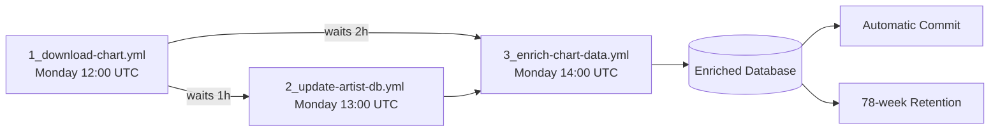

# Script 3: YouTube Chart Enrichment System


## 📋 General Overview

This script is the third component of the YouTube Charts Intelligence system. It takes the weekly charts database generated by the downloader and the artist metadata from the enrichment system, and combines them with detailed YouTube metadata using an intelligent three-layer system. The result is a fully enriched database ready for analysis and visualization.

### Key Features

- **3-Layer Retrieval System**: YouTube API (priority) → Selenium → yt-dlp (last resort) for maximum reliability
- **Optimized Performance**: Processes 100 songs in ~2 minutes using the YouTube API (vs. 8+ minutes with pure yt-dlp)
- **Collaboration Weighting System**: Intelligent algorithm that determines country and genre when multiple artists are involved
- **Country-Based Cultural Hierarchies**: Ordered genre lists that reflect local importance (e.g., K-Pop first in South Korea)
- **Video Metadata Detection**: Identifies whether a video is official, a lyric video, live performance, remix, etc.
- **Channel Classification**: Detects VEVO, Topic, Label/Studio, Artist Channel, and more
- **Automatic Updates**: Selects the most recent charts database and generates its enriched version
- **CI/CD Optimized**: Specifically designed to run in GitHub Actions without manual intervention

---

## 📊 Process Flow Diagrams

### Diagram 1: Execution Flow


This diagram shows the execution flow:

- **Input**: Automatically finds the most recent database in `charts_archive/1_download-chart/databases/` (reverse lexicographic order → `youtube_charts_2026-W11.db`)

- **Artist Data Download**: Retrieves `artist_countries_genres.db` from GitHub (temporary file) and loads into memory a dictionary `{normalized_name: (country, genre)}`

- **Song Reading**: Connects to the charts database and reads the 100 songs from the `chart_data` table (columns: Rank, Artist Names, Track Name, YouTube URL, etc.)

- **Output Preparation**: Creates the `enriched_songs` table in the output database (`charts_archive/3_enrich-chart-data/{name}_enriched.db`) with indexes for fast queries

- **For each song (×100)**:

  a. **Artist Extraction**:
  - Splits names using multiple delimiters (`&`, `feat.`, `ft.`, `,`, `y`, `and`, `with`, `x`, `vs`)
  - Example: `"ROSÉ & Bruno Mars"` → `["ROSÉ", "Bruno Mars"]`

  b. **Artist Data Lookup**:
  - Normalizes each name (lowercase, no special characters)
  - Queries the artist dictionary
  - Result: list of dictionaries `[{'name': x, 'country': y, 'genre': z}]`

  c. **Collaboration Weighting System**:
  - **Single artist** → uses their country and genre
  - **Absolute majority (>50%)** from same country → that country wins + local hierarchical genre
  - **Exact majority (50%)**:
    - 2 distinct countries → majority wins
    - 3+ countries → "Multicountry" + "Multigenre"
  - **Relative majority (<50%)**:
    - Same continent and ≤2 countries → majority wins
    - Different continents → "Multicountry" + "Multigenre"
  - **All unknown** → "Unknown" + "Pop"

  d. **YouTube Metadata Retrieval** (3-layer system):

  - **Layer 1 — YouTube API (priority)**:
    - Extracts video_id from URL
    - Queries YouTube Data API v3
    - Retrieves: exact duration, likes, comments, language, date, regional restrictions
    - Speed: ~0.3–0.8 seconds per video
    - On failure (quota/error) → falls back to Layer 2

  - **Layer 2 — Selenium (main fallback)**:
    - Launches headless Chrome browser
    - Extracts duration from player, title, channel name
    - Detects video type from title (official, lyric, live)
    - Speed: ~3–5 seconds per video
    - On failure → falls back to Layer 3

  - **Layer 3 — yt-dlp (last resort)**:
    - Tries multiple client configurations (android, iOS, web)
    - With delays between attempts to avoid blocks
    - Retrieves full metadata when possible
    - Speed: ~2–4 seconds per video

  e. **Additional Detection**:
  - Video type: official, lyric, live, remix (from title/description)
  - Channel type: VEVO, Topic, Label/Studio, Artist Channel, etc.
  - Upload quarter: Q1–Q4 based on date
  - Collaboration: detects feat./& in title

  f. **Database Insertion**:
  - Combines: chart data + metadata + resulting country/genre
  - Saves to `enriched_songs`
  - Includes `error` field if something failed

---

### Diagram 2: Module Architecture


1. **Lookup Tables**:
   - `COUNTRY_TO_CONTINENT`: Map assigning 196 countries to their continents
   - `GENRE_HIERARCHY`: Ordered genre lists per country (local cultural priority)

2. **Collaboration Weighting System**:
   - `get_continent`: Gets continent of a country from `COUNTRY_TO_CONTINENT`
   - `infer_genre_by_country`: Selects genre according to local hierarchy when multiple artists share the same country
   - `resolve_country_and_genre`: Main decision engine with rules (>50%, =50%, <50%)

3. **Text Classifiers**:
   - `detect_video_type`: Identifies whether the video is official, lyric, live, or remix
   - `detect_collaboration`: Detects collaborations in the title (feat., &, with)
   - `detect_channel_type`: Classifies the channel (VEVO, Topic, Label/Studio, Artist)
   - `parse_upload_season`: Determines the upload quarter (Q1–Q4)

4. **Metadata Retrieval System (3 layers)**:
   - **Layer 1 — YouTube API v3**: Retrieves full metadata (0.3–0.8s/video). Requires API key
   - **Layer 2 — Selenium**: Extracts partial metadata using headless browser (3–5s/video)
   - **Layer 3 — yt-dlp**: Last resort with client rotation (android/ios/web)

5. **Input Database Utilities**:
   - `find_latest_chart_db`: Locates the most recent `.db` file in `/databases`
   - `load_chart_songs`: Reads the 100 songs from the `chart_data` table
   - `download_artist_db`: Downloads `artist_countries_genres.db` from GitHub
   - `build_artist_lookup`: Builds dictionary `{normalized_name: (country, genre)}`
   - `get_artist_info`: Queries each artist's information from the dictionary

6. **Output Database Utilities**:
   - `create_output_table`: Creates `enriched_songs` table with 25 columns and 4 indexes
   - `insert_enriched_row`: Inserts a row with all enriched data
   - `enriched_songs`: Final table with query-optimized structure

7. **Text Utilities**:
   - `normalize_name`: Cleans names (lowercase, no special characters)
   - `parse_artist_list`: Splits artists using multiple delimiters
   - `_empty_metadata`: Dictionary with default values (zero/empty)

---

## 🔍 Detailed Analysis of `3_enrich-chart-data.py`

### Code Structure

#### **1. Configuration and Paths**

```python
SCRIPT_DIR = Path(__file__).parent.absolute()
PROJECT_ROOT = SCRIPT_DIR.parent
INPUT_DB_DIR = PROJECT_ROOT / "charts_archive" / "1_download-chart" / "databases"
URL_ARTIST_DB = "https://github.com/adroguetth/Music-Charts-Intelligence/raw/refs/heads/main/charts_archive/2_countries-genres-artist/artist_countries_genres.db"
OUTPUT_DIR = PROJECT_ROOT / "charts_archive" / "3_enrich-chart-data"
```

The script integrates the two previous components:

- **Input**: Weekly charts database from step 1 (`youtube_charts_YYYY-WXX.db`)
- **Reference**: Artist database from step 2 (`artist_countries_genres.db` from GitHub)
- **Output**: Enriched database (`charts_archive/3_enrich-chart-data/{name}_enriched.db`)

---

#### **2. Metadata Retrieval System (3 Layers)**

The key innovation of the script is its multi-layer strategy that always prioritizes the fastest and most reliable method:

```python
def get_specific_metadata(url, artists_csv="", api_key=None):
    """
    Retrieves video metadata using a 3-layer strategy:
    - Layer 1: YouTube API v3 (0.3-0.8s/video) → if key and quota available
    - Layer 2: Selenium (3-5s/video) → simulates browser, avoids blocks
    - Layer 3: yt-dlp (2-4s/video) → last resort with client rotation
    """
```

**Layer 1 — YouTube API v3 (priority):**

```python
# Extracts video_id from URL
video_id_match = re.search(r'(?:v=|\/)([0-9A-Za-z_-]{11})', url)
youtube = build('youtube', 'v3', developerKey=api_key)
response = youtube.videos().list(
    part='snippet,contentDetails,statistics',
    id=video_id
).execute()

# Retrieved metadata:
# - duration_iso → isodate.parse_duration() → seconds
# - likeCount, commentCount
# - defaultAudioLanguage
# - regionRestriction
# - publishedAt → date and quarter
# - title, description, channelTitle
```

**Layer 2 — Selenium (main fallback):**

```python
chrome_options = Options()
chrome_options.add_argument("--headless=new")
chrome_options.add_argument("--no-sandbox")
chrome_options.add_argument("--disable-dev-shm-usage")

driver.get(url)
# Extracts title from player
title = driver.find_element(By.CSS_SELECTOR, "h1.ytd-video-primary-info-renderer").text
# Extracts duration from player
duration = driver.find_element(By.CSS_SELECTOR, "span.ytp-time-duration").text
# Extracts channel name
channel = driver.find_element(By.CSS_SELECTOR, "a.ytd-channel-name").text
# Extracts date from meta tag
date = driver.find_element(By.CSS_SELECTOR, "meta[itemprop='datePublished']").get_attribute("content")
```

**Layer 3 — yt-dlp (last resort with anti-blocking):**

```python
# Tries multiple client configurations
clients = [
    {'player_client': ['android']},
    {'player_client': ['ios']},
    {'player_client': ['android', 'web']},
    {'player_client': ['web']},
]

for opts in clients:
    ydl_opts = {
        'quiet': True,
        'ignoreerrors': False,
        'user_agent': 'Mozilla/5.0 ... Chrome/120.0.0.0',
        'extractor_retries': 5,
        'sleep_interval': 2,
        **opts
    }
    try:
        info = ydl.extract_info(url, download=False)
        if info: break
    except: continue
```

---

#### **3. Core Reference Tables**

**Country-to-Continent Map (196 countries):**

```python
COUNTRY_TO_CONTINENT = {
    # Asia
    "South Korea": "Asia", "Japan": "Asia", "China": "Asia",
    # Americas
    "United States": "America", "Canada": "America", "Mexico": "America",
    # Europe
    "United Kingdom": "Europe", "France": "Europe", "Germany": "Europe",
    # Africa
    "Nigeria": "Africa", "South Africa": "Africa", "Egypt": "Africa",
    # Oceania
    "Australia": "Oceania", "New Zealand": "Oceania",
    # ... 196 countries total
}
```

**Genre Hierarchies by Country (local cultural priority):**

```python
GENRE_HIERARCHY = {
    "United States": [
        "Pop", "Hip-Hop/Rap", "R&B/Soul", "Country", "Rock",
        "Alternative", "Electronic/Dance", "Reggaeton/Latin Trap"
    ],
    "South Korea": [
        "K-Pop/K-Rock", "Hip-Hop/Rap", "Rock", "Ballad", "Trot"
    ],
    "Brazil": [
        "Sertanejo", "Funk Brasileiro", "Reggaeton/Latin Trap",
        "Pop", "Rock", "Hip-Hop/Rap", "Forró", "Axé", "MPB"
    ],
    "Nigeria": [
        "Afrobeats", "Hip-Hop/Rap", "Gospel", "Jùjú", "Fuji"
    ],
    # ... 100+ countries with custom hierarchies
}
```

---

#### **4. Collaboration Weighting System**

The `resolve_country_and_genre` algorithm implements precise rules:

```python
def resolve_country_and_genre(artists_info):
    """
    Decision algorithm for collaborations:

    Case 1: Absolute majority (>50%)
        → winning country + hierarchical genre

    Case 2: Exact majority (50%)
        - 2 distinct countries → majority wins
        - 3+ distinct countries → "Multicountry" + "Multigenre"

    Case 3: Relative majority (<50%)
        - Same continent and ≤2 countries → majority wins
        - Different continents → "Multicountry" + "Multigenre"

    Case 4: All unknown → "Unknown" + "Pop"
    """
```

**Execution example:**

```python
# Collaboration: "ROSÉ (South Korea) & Bruno Mars (USA)"
artists_info = [
    {'name': 'ROSÉ', 'country': 'South Korea', 'genre': 'K-Pop'},
    {'name': 'Bruno Mars', 'country': 'United States', 'genre': 'Pop'}
]
# 50% - 50% with 2 distinct countries → "Multicountry" + "Multigenre"
# (exact 50% with 2 distinct countries rule applies)
```

**Hierarchical genre selection function:**

```python
def infer_genre_by_country(artists_info):
    country = artists_info[0]['country']
    hierarchy = GENRE_HIERARCHY.get(country, [DEFAULT_GENRE])

    # If there is a clearly dominant genre, use it
    counter = Counter([a['genre'] for a in artists_info if a['genre']])
    if counter and counter.most_common(1)[0][1] > len(artists_info)/2:
        return counter.most_common(1)[0][0]

    # Otherwise, pick the highest-ranked genre among those present
    for priority_genre in hierarchy:
        if priority_genre in [a['genre'] for a in artists_info]:
            return priority_genre

    return hierarchy[0]
```

---

#### **5. Text Classifiers**

**Video type detection:**

```python
def detect_video_type(title, description=""):
    text = f"{title.lower()} {description.lower()}"

    is_official = any(p in text for p in ['official', 'official music video'])
    is_lyric = any(p in title.lower() for p in ['lyric', 'lyrics'])
    is_live = any(p in text for p in ['live', 'concert', 'performance'])
    is_remix = any(p in title.lower() for p in ['remix', 'sped up', 'slowed', 'acoustic'])

    return {
        'is_official_video': is_official,
        'is_lyric_video': is_lyric,
        'is_live_performance': is_live,
        'is_special_version': is_remix
    }
```

**Collaboration detection:**

```python
def detect_artist_collaboration(title, artists_csv):
    patterns = [
        r'\sft\.\s', r'\sfeat\.\s', r'\sfeaturing\s',
        r'\s&\s', r'\sx\s', r'\swith\s'
    ]

    is_collaboration = any(re.search(p, title.lower()) for p in patterns)

    # Estimate number of artists
    if artists_csv:
        artist_count = artists_csv.count('&') + artists_csv.count(',') + 1
    else:
        artist_count = 2 if is_collaboration else 1

    return {
        'is_collaboration': is_collaboration,
        'artist_count': min(artist_count, 10)
    }
```

**Channel classification:**

```python
def detect_channel_type(channel_title):
    channel_lower = channel_title.lower()

    if 'vevo' in channel_lower:
        return {'channel_type': 'VEVO'}
    elif 'topic' in channel_lower:
        return {'channel_type': 'Topic'}
    elif any(w in channel_lower for w in ['records', 'music', 'label']):
        return {'channel_type': 'Label/Studio'}
    elif any(w in channel_lower for w in ['official', 'artist', 'band']):
        return {'channel_type': 'Artist Channel'}
    else:
        return {'channel_type': 'General'}
```

---

#### **6. Main Processing**

```python
def main():
    # 1. Find latest charts database
    chart_db_path = find_latest_db()
    # → youtube_charts_2026-W11.db

    # 2. Download and load artist database
    artist_temp_path = download_artist_db(URL_ARTIST_DB)
    artists_dict = load_artist_db_to_dict(artist_temp_path)
    # → {normalized_name: (country, genre)} with 2323 artists

    # 3. Read songs
    songs = read_songs_from_db(chart_db_path)
    # → 100 songs with Rank, Artist Names, Track Name, YouTube URL

    # 4. Prepare output database
    output_db_path = OUTPUT_DIR / f"{base_name}_enriched.db"
    conn_out = sqlite3.connect(output_db_path)
    create_results_table(conn_out)

    # 5. Process each song
    for i, song in enumerate(songs, 1):
        # Extract artists
        artists_info = get_artist_info(artists_csv, artists_dict)

        # Determine country/genre (weighting system)
        final_country, final_genre = resolve_country_and_genre(artists_info)

        # Get YouTube metadata (3 layers)
        metadata = get_specific_metadata(url, artists_csv, YOUTUBE_API_KEY)

        # Build and save row
        row = build_row(song, metadata, final_country, final_genre)
        save_to_sqlite(conn_out, row)
```

---

#### **7. Output Database Schema**

```sql
CREATE TABLE enriched_songs (
    id INTEGER PRIMARY KEY AUTOINCREMENT,
    rank INTEGER,
    artist_names TEXT,
    track_name TEXT,
    periods_on_chart INTEGER,
    views INTEGER,
    youtube_url TEXT,
    duration_s INTEGER,
    duration_ms TEXT,
    upload_date TEXT,
    likes INTEGER,
    comment_count INTEGER,
    audio_language TEXT,
    is_official_video BOOLEAN,
    is_lyric_video BOOLEAN,
    is_live_performance BOOLEAN,
    upload_season TEXT,
    channel_type TEXT,
    is_collaboration BOOLEAN,
    artist_count INTEGER,
    region_restricted BOOLEAN,
    artist_country TEXT,
    macro_genre TEXT,
    artists_found TEXT,
    error TEXT,
    processing_date TIMESTAMP DEFAULT CURRENT_TIMESTAMP
);

-- Indexes for fast queries
CREATE INDEX idx_country ON enriched_songs(artist_country);
CREATE INDEX idx_genre ON enriched_songs(macro_genre);
CREATE INDEX idx_date ON enriched_songs(upload_date);
CREATE INDEX idx_error ON enriched_songs(error);
```

---

#### **8. CI/CD Optimizations**

```python
# Automatic environment detection
IN_GITHUB_ACTIONS = os.environ.get("GITHUB_ACTIONS") == "true"

# No interaction in CI
if IN_GITHUB_ACTIONS:
    # Automatic execution
    main()
else:
    # Local interactive mode
    response = input("Continue? (y/n): ")
    if response in ['y', 'yes']:
        main()

# API Key from environment variable (never hardcoded)
YOUTUBE_API_KEY = os.environ.get("YOUTUBE_API_KEY", "")
```

---

#### **9. Metrics and Statistics**

Upon completion, the script displays detailed statistics:

```
📊 FINAL STATISTICS
   • Total songs: 100
   • Multi-country collaborations: 24 (24.0%)
   • Distinct countries detected: 28
   • Distinct genres: 15
   • Songs without country: 3 (3.0%)
   • Songs with metadata errors: 2 (2.0%)
```

---

## ⚙️ GitHub Actions Workflow Analysis (`3_enrich-chart-data.yml`)

### **Workflow Structure**

```yaml
name: 3- Enrich Chart Data
on:
  schedule:
    - cron: '0 14 * * 1'  # Monday 14:00 UTC (2h after download)
  workflow_dispatch:       # Manual execution
  push:                    # Triggered on script changes
    branches:
      - main
    paths:
      - 'scripts/3_enrich_chart_data.py'
      - '.github/workflows/3_enrich-chart-data.yml'
```

### **Jobs and Steps**

#### **Job: `enrich-chart-data`**

- **Operating system**: Ubuntu Latest
- **Timeout**: 60 minutes
- **Permissions**: Write access to repository
- **Environment variable**: `RETENTION_WEEKS: 78` (1.5 years retention)
  - **Calculation**: 78 weeks × 7 days = 546 days
  - **Cleanup**: Automatic on each run

#### **Detailed Steps:**

**📚 Repository Checkout**

```yaml
uses: actions/checkout@v4
with:
  fetch-depth: 0  # Full history for git operations
```

**🐍 Python 3.12 Setup**

```yaml
uses: actions/setup-python@v5
with:
  python-version: "3.12"
  cache: 'pip'  # Dependency cache for faster builds
```

**📦 Install Dependencies**

```bash
pip install -r requirements.txt
```

**📁 Create Directory Structure**

```bash
mkdir -p charts_archive/1_download-chart/databases
mkdir -p charts_archive/3_enrich-chart-data
```

**🚀 Run Enrichment Script**

```yaml
run: |
  python scripts/3_enrich_chart_data.py
env:
  YOUTUBE_API_KEY: ${{ secrets.YOUTUBE_API_KEY }}  # API key from secrets
  GITHUB_ACTIONS: true  # Environment detection variable
```

**✅ Verify Results**

- List of files generated in `charts_archive/3_enrich-chart-data/`
- Verify existence of enriched databases
- File size statistics

**📤 Automatic Commit and Push**

```bash
# Automatic user configuration
git config --global user.name "github-actions[bot]"
git config --global user.email "github-actions[bot]@users.noreply.github.com"

# Stage only enriched files
git add charts_archive/3_enrich-chart-data/

# Pull with rebase before push to avoid conflicts
git pull --rebase origin main
git push origin HEAD:main
```

**📦 Artifact Upload (on failure only)**

```yaml
if: failure()  # Only runs if workflow fails
uses: actions/upload-artifact@v4
with:
  name: enrich-debug-${{ github.run_number }}
  path: |
    scripts/3_enrich_chart_data.py.log
    charts_archive/3_enrich-chart-data/
  retention-days: 7
```

**🧹 Old Database Cleanup**

```bash
# Deletes files older than RETENTION_WEEKS (78 weeks = 546 days)
find charts_archive/3_enrich-chart-data/ \
  -name "*_enriched.db" \
  -type f \
  -mtime +$((RETENTION_WEEKS * 7)) \
  -delete
```

**📋 Final Report** (always runs)

```bash
# Displays:
# - Execution date and trigger
# - Latest enriched database and its size
# - Database statistics (total songs, multi-country, errors)
# - Total stored databases and retention policy
```

### **Cron Schedule**

```
'0 14 * * 1'  # Minute 0, Hour 14, Any day of month, Any month, Monday
```

- **Execution**: Every Monday at 14:00 UTC
- **Offset**: 2 hours after the download workflow (`1_download-chart.yml`)
- **Reason**: Wait for the previous workflow to complete downloading the new charts

---

## 🔐 Required Secrets

| Secret            | Purpose                                                 |
| :---------------- | :------------------------------------------------------ |
| `YOUTUBE_API_KEY` | YouTube Data API v3 key for retrieving video metadata   |

---

## 🔄 Integration Flow



---

## 🚀 Local Installation and Setup

### **Prerequisites**

- Python 3.12 or higher
- Git installed
- Internet access
- YouTube Data API v3 key (optional but recommended)

### **Step-by-Step Installation**

1. **Clone the Repository**

```bash
git clone https://github.com/adroguetth/Music-Charts-Intelligence
cd Music-Charts-Intelligence
```

2. **Create a Virtual Environment (recommended)**

```bash
python -m venv venv

# Windows
venv\Scripts\activate

# Linux/Mac
source venv/bin/activate
```

3. **Install Dependencies**

```bash
pip install -r requirements.txt
```

4. **Set Environment Variables**

```bash
# Linux/Mac
export YOUTUBE_API_KEY="your-api-key"

# Windows PowerShell
$env:YOUTUBE_API_KEY="your-api-key"
```

5. **Run the Script Manually**

```bash
python scripts/3_enrich_chart_data.py
```

### **Development Configuration**

**Optional Environment Variables**

```bash
# Simulate GitHub Actions environment
export GITHUB_ACTIONS=true

# Run without interaction (no confirmation prompt)
export YOUTUBE_API_KEY="your-api-key"
```

**Run with Test Data**

```bash
# Create directory structure
mkdir -p charts_archive/1_download-chart/databases

# Copy a test database (if available)
cp /path/to/a/database.db charts_archive/1_download-chart/databases/

# Run script
python scripts/3_enrich_chart_data.py
```

---

## 📁 Generated File Structure

```text
charts_archive/
├── 1_download-chart/
│   ├── latest_chart.csv
│   ├── databases/
│   │   ├── youtube_charts_2025-W01.db
│   │   ├── youtube_charts_2025-W02.db
│   │   └── ...
│   └── backup/
│       └── ...
├── 2_countries-genres-artist/
│   └── artist_countries_genres.db       # Artist database (country/genre)
└── 3_enrich-chart-data/                  # ← Output of this script
    ├── youtube_charts_2025-W01_enriched.db
    ├── youtube_charts_2025-W02_enriched.db
    └── ...
```

### **Database Growth**

- **Weekly execution**: 100 songs processed
- **Size per database**: ~200–300 KB per `.db` file
- **Annual storage**: ~15–20 MB (52 weeks × 300 KB)
- **Configured retention**: 78 weeks (1.5 years) → ~30–40 MB maximum

### **Generated Columns per Song (25 fields)**

| Category            | Fields                                                                          |
| :------------------ | :------------------------------------------------------------------------------ |
| **Identifiers**     | `rank`, `artist_names`, `track_name`                                            |
| **Chart Metrics**   | `periods_on_chart`, `views`, `youtube_url`                                      |
| **Video Metadata**  | `duration_s`, `duration_ms`, `upload_date`, `likes`, `comment_count`, `audio_language` |
| **Video Flags**     | `is_official_video`, `is_lyric_video`, `is_live_performance`                    |
| **Context**         | `upload_season`, `channel_type`, `is_collaboration`, `artist_count`, `region_restricted` |
| **Enrichment**      | `artist_country`, `macro_genre`, `artists_found`                                |
| **Control**         | `error`, `processing_date`                                                      |

---

## 🔧 Customization and Configuration

### **Adjustable Parameters in the Script**

```python
# In 3_enrich_chart_data.py
INPUT_DB_DIR = PROJECT_ROOT / "charts_archive" / "1_download-chart" / "databases"
URL_ARTIST_DB = "https://github.com/..."  # Artist database URL
OUTPUT_DIR = PROJECT_ROOT / "charts_archive" / "3_enrich-chart-data"

# Timeouts and delays
SLEEP_BETWEEN_VIDEOS = 0.1      # Pause between videos (seconds)
YT_DLP_RETRIES = 5               # Retries for yt-dlp
SELENIUM_TIMEOUT = 10             # Selenium timeout (seconds)
```

### **Workflow Configuration**

```yaml
# In 3_enrich-chart-data.yml
env:
  RETENTION_WEEKS: 78       # Retention weeks (1.5 years)

timeout-minutes: 60          # Maximum total time
```

### **Adding New Artist Delimiters**

```python
# In parse_artist_list()
separators = [
    '&', 'feat.', 'ft.', ',', ' y ', ' and ',
    ' with ', ' x ', ' vs ',           # Existing
    ' présentation ', ' en duo avec ', # New for French
    ' und ', ' & ',                    # New for German
    ' e ', ' com '                     # New for Portuguese
]
```

### **Expanding Genre Hierarchies by Country**

```python
# In GENRE_HIERARCHY
"New Country": [
    "Primary Genre",     # Priority 1
    "Secondary Genre",   # Priority 2
    "Tertiary Genre",    # Priority 3
    "Niche Genre"        # Priority 4
]
```

### **Modifying Weighting System Rules**

```python
# In resolve_country_and_genre()
# Adjust thresholds or add new rules
if majority_percentage > 0.6:  # Change from 0.5 to 0.6
    # New logic...
```

---

## 🐛 Troubleshooting

##### **Error: "No module named 'isodate'"**

**Cause**: Missing library for ISO duration conversion.

```bash
pip install isodate
```

##### **Error: "Selenium: ChromeDriver not found"**

**Cause**: Chrome not installed or webdriver-manager fails.

```bash
# Install Chrome (Linux)
sudo apt-get update
sudo apt-get install -y google-chrome-stable

# webdriver-manager installs automatically (handled by the script)
```

#### **Error: "No database found"**

**Solution**

```bash
# Verify at least one charts database exists
ls -la charts_archive/1_download-chart/databases/
# If none, run the download workflow first
```

#### **Error: "Sign in to confirm you're not a bot"**

**Cause**: YouTube blocks yt-dlp in automated environments.

**Solutions**:

1. ✅ **Prioritize API**: Ensure `YOUTUBE_API_KEY` is configured
2. 🔄 **Use Selenium**: The script auto-falls back to Selenium
3. 🍪 **Export cookies** (last resort):

```bash
# Export cookies from browser
yt-dlp --cookies-from-browser chrome "URL"
```

#### **Error: "No enriched database found" in final report**

**Cause**: The script could not generate any database.

**Checks**:

```bash
# 1. Do input chart databases exist?
ls -la charts_archive/1_download-chart/databases/

# 2. Are there .db files in the output directory?
ls -la charts_archive/3_enrich-chart-data/

# 3. Review error logs in GitHub Actions
# Check the 'error' column from previous runs
```

#### **Error: "API key not valid"**

**Cause**: Invalid API key or insufficient permissions.

**Solutions**:

1. Verify in [Google Cloud Console](https://console.cloud.google.com/)
2. Enable YouTube Data API v3
3. Regenerate key if necessary
4. Check IP/domain restrictions

#### **Error: "Quota exceeded"**

**Cause**: Too many requests to the API.

**Solutions**:

```text
# 1. Increase quota in Google Cloud (paid plan)
# 2. Distribute executions over time
# 3. The script automatically falls back to Selenium
```

#### **GitHub Actions Error: "No space left on device"**

**Cause**: Too many stored databases.

**Solution**:

```bash
# Check retention policy
echo $RETENTION_WEEKS  # Should be 78

# Clean up manually if needed
find charts_archive/3_enrich-chart-data -name "*_enriched.db" -mtime +546 -delete
```

#### **Issue: Very slow processing (>10 minutes)**

**Cause**: API Key not configured or failing.

**Checks**:

```bash
# 1. Is YOUTUBE_API_KEY configured?
echo $YOUTUBE_API_KEY

# 2. Check logs: which layer is being used?
# Search for "⚠️ Metadata error" in the logs
```

### **Diagnostic Commands**

```bash
# Verify directory structure
tree charts_archive/ -L 2

# Count enriched databases
ls -1 charts_archive/3_enrich-chart-data/*_enriched.db 2>/dev/null | wc -l

# View total size
du -sh charts_archive/3_enrich-chart-data/

# Query a specific database
sqlite3 charts_archive/3_enrich-chart-data/youtube_charts_2026-W11_enriched.db \
  "SELECT artist_country, COUNT(*) FROM enriched_songs GROUP BY artist_country ORDER BY COUNT(*) DESC LIMIT 5;"

# View records with errors
sqlite3 charts_archive/3_enrich-chart-data/youtube_charts_2026-W11_enriched.db \
  "SELECT rank, track_name, error FROM enriched_songs WHERE error != '';"
```

### **Local Debugging**

```bash
# Run with verbose logging
export PYTHONVERBOSE=1
python scripts/3_enrich_chart_data.py

# Test a specific video with yt-dlp
yt-dlp --dump-json "https://youtube.com/watch?v=VIDEO_ID"

# Test API directly
curl -X GET "https://www.googleapis.com/youtube/v3/videos?part=snippet&id=VIDEO_ID&key=YOUR_API_KEY"
```

---

## 📈 Performance Metrics

| Scenario               | Time          | Notes                             |
| :--------------------- | :------------ | :-------------------------------- |
| **With API Key**       | ~2 minutes    | 100 songs, 0.3–0.8s per video     |
| **No API (Selenium)**  | ~5–7 minutes  | Depends on page load speed        |
| **No API (yt-dlp)**    | ~8–10 minutes | May fail due to blocking          |

---

## 📄 License and Attribution

- **License**: MIT
- **Author**: Alfonso Droguett
  - 🔗 **LinkedIn:** [Alfonso Droguett](https://www.linkedin.com/in/adroguetth/)
  - 🌐 **Portfolio:** [adroguett-portfolio.cl](https://www.adroguett-portfolio.cl/)
  - 📧 **Email:** adroguett.consultor@gmail.com

### **Technologies Used**

| Technology              | Purpose                                  | Version     |
| :---------------------- | :--------------------------------------- | :---------- |
| **Python**              | Main language                            | 3.12        |
| **YouTube Data API v3** | Video metadata (layer 1)                 | -           |
| **Selenium**            | Headless browser fallback (layer 2)      | ≥4.15.0     |
| **yt-dlp**              | Anti-blocking last resort (layer 3)      | ≥2023.10.13 |
| **SQLite**              | Result storage                           | -           |
| **GitHub Actions**      | CI/CD automation                         | -           |

### **Special Attributions**

- **yt-dlp**: Inspiration for blocking handling and client rotation
- **Open Source Community**: For the libraries that make this project possible

---

## 🤝 Contributing

### **How to Contribute**

1. **Report issues** with full records (include error logs)
2. **Propose improvements** with concrete use cases
3. **Add new genre mappings** with artist examples
4. **Contribute country variants** (especially for underrepresented regions)
5. **Maintain compatibility** with the existing database structure

### **Quick Contribution Guide**

```bash
# 1. Fork the repository
# 2. Clone your fork
git clone https://github.com/your-username/Music-Charts-Intelligence

# 3. Create a branch for your contribution
git checkout -b feature/new-feature

# 4. Make changes and test locally
python scripts/3_enrich_chart_data.py --test

# 5. Commit with a descriptive message
git commit -m "Add support for new genre X"

# 6. Push and create Pull Request
git push origin feature/new-feature
```

### **Priority Contribution Areas**

- ✅ Expand `GENRE_HIERARCHY` for missing countries
- ✅ Improve collaboration detection with new patterns
- ✅ Optimize Selenium CSS selectors (frequently changed by YouTube)
- ✅ Add more languages to writing detection
- ✅ Create automated tests

---

## 🧪 Known Limitations and Future Improvements

### **Current Limitations**

- **API Dependency**: The system relies on YouTube Data API v3, which has a daily quota (10,000 units)
- **YouTube Blocking**: yt-dlp may be blocked in CI environments without cookies/PO Tokens
- **Selenium in CI**: Requires Chrome installed and may be slower in GPU-less environments
- **CSS Selectors**: Selenium selectors may break with YouTube UI changes
- **New Artists**: Recently emerging artists may not appear in the artist database
- **Niche Genres**: Some micro-genres may not have mappings in the hierarchy
- **Complex Collaborations**: Collaborations with 5+ artists may be difficult to resolve

### **Known Cases with Special Behavior**

| Case                                                          | Current Behavior             | Proposed Improvement           |
| :------------------------------------------------------------ | :--------------------------- | :----------------------------- |
| **K-Pop groups with foreign members**                         | Country: South Korea         | Detect individual members      |
| **Brazilian MCs**                                             | Genre: Sertanejo (fallback)  | Prioritize Funk Brasileiro     |
| **Latin collaborations with lead artist from another country** | May yield Multicountry       | Analyze order of mention       |
| **Region-blocked videos**                                     | `region_restricted: true`    | Retry with proxy/VPN           |

---

## 📊 Project Success Metrics

### **Current Achievements**

| Metric                        | Value                     |
| :---------------------------- | :------------------------ |
| **Processing time**           | 2 minutes (100 songs)     |
| **API success rate**          | ~98% (with valid key)     |
| **Countries detected**        | 28 per week               |
| **Distinct genres**           | 15 per week               |
| **Multi-country collabs**     | ~24% of total             |
| **Artists without country**   | <3%                       |

### **Goals for V2.0**

| Metric                        | Target                    |
| :---------------------------- | :------------------------ |
| **Processing time**           | <1 minute (100 songs)     |
| **API success rate**          | 99.5%                     |
| **Countries detected**        | 35+ per week              |
| **Distinct genres**           | 20+ per week              |
| **Artists without country**   | <1%                       |

---

**⭐ If you find this project useful, consider giving it a star on GitHub!**
