# Script 2: Artist Country + Genre Detection System, Enriquecimiento Inteligente
  [](#) [](#)  [](#)  

## 📥 Descarga Rápida
| Documento                  | Formato                                                       |
| ------------------------- | ------------------------------------------------------------ |
| **🇬🇧 Documentación en inglés** | [PDF](https://drive.google.com/file/d/1viUAxZ7k-qeYYbyvZf2OaP20AfLOgKh2/view?usp=drive_link) |
| **🇪🇸 Documentación en español** | [PDF](https://drive.google.com/file/d/1WBHBreKeVToTBygSyCuYsHQUr_zSl3BT/view?usp=drive_link) |

## 📋 Descripción General

Este proyecto es el segundo componente del sistema de inteligencia de YouTube Charts. Toma los nombres de artistas en bruto extraídos por el descargador y los **enriquece con metadatos geográficos y de género** consultando múltiples bases de conocimiento abiertas. El resultado es una base de datos estructurada de artistas con su país de origen y género musical principal.

### Características Principales

- **Búsqueda Multi-Fuente**: Consultas inteligentes en cascada a MusicBrainz, Wikipedia (resumen e infobox) y Wikidata
- **Variación Inteligente de Nombres**: Genera hasta 15 variaciones por artista (sin acentos, prefijos eliminados, etc.) para máxima tasa de coincidencia
- **Inteligencia Geográfica**: Detección de país a partir de ciudades, gentilicios y referencias regionales usando un diccionario curado de más de 30.000 términos
- **Clasificación de Géneros**: Más de 200 macro-géneros y 5.000+ mapeos de subgéneros con sistema de votación ponderada
- **Reglas Específicas por País**: Manejo especial para más de 50 países (ej. K-Pop para Corea del Sur, Sertanejo para Brasil)
- **Detección de Escritura**: Detección automática de idioma para escrituras no latinas (cirílico, devanagari, árabe, hangul, etc.)
- **Actualizaciones Inteligentes**: Solo completa datos faltantes, nunca sobrescribe información correcta existente
- **Caché en Memoria**: Evita llamadas API redundantes durante la ejecución
- **Optimizado para CI/CD**: Configurado específicamente para GitHub Actions con fallbacks progresivos

## 📊 Diagrama de Flujo del Proceso

```mermaid
graph TD
    classDef input fill:#e1f5fe,stroke:#01579b,stroke-width:2px;
    classDef process fill:#fff3e0,stroke:#e65100,stroke-width:2px;
    classDef api fill:#f3e5f5,stroke:#4a148c,stroke-width:2px;
    classDef cache fill:#e8f5e8,stroke:#1b5e20,stroke-width:2px;
    classDef decision fill:#ffebee,stroke:#b71c1c,stroke-width:2px;
    classDef output fill:#e0f2f1,stroke:#004d40,stroke-width:2px;
    A[(Base de Datos de Charts<br/>youtube_charts_YYYY-WXX.db)] --> B[Leer artistas del chart]
    B --> C["Separar artistas<br/>(manejar feat., &, etc.)"]
    C --> D{Obtener lista de<br/>artistas únicos}
    D --> E[Por cada artista...]
    E --> F{¿El artista ya existe<br/>en artist_countries_genres.db?}
    F -->|"__p65__"| G[Mostrar ✅ y continuar]
    F -->|"__p66__"| H[Buscar solo información faltante]
    F -->|"__p67__"| I[Buscar país y género completos]
    H --> J[Iniciar búsqueda de país]
    I --> J
    
    subgraph Búsqueda_País["__p9__"]
        J --> K[Generar variaciones<br/>de nombre]
        K --> L["Consultar MusicBrainz<br/>(caché)"]
        L --> M{¿País encontrado?}
        M -->|"__p68__"| N[✅ País detectado]
        M -->|"__p69__"| O["Consultar Wikipedia EN<br/>(resumen + infobox)"]
        O --> P{¿País encontrado?}
        P -->|"__p70__"| N
        P -->|"__p71__"| Q[Consultar Wikipedia en<br/>idiomas prioritarios*]
        Q --> R{¿País encontrado?}
        R -->|"__p72__"| N
        R -->|"__p73__"| S[Consultar Wikidata]
        S --> T{¿País encontrado?}
        T -->|"__p74__"| N
        T -->|"__p75__"| U[País = Desconocido]
    end
    N --> V[Iniciar búsqueda de género]
    U --> V
    
    subgraph Búsqueda_Género["__p18__"]
        V --> W[Generar variaciones<br/>de nombre]
        W --> X["MusicBrainz<br/>(géneros/etiquetas)"]
        X --> Y[Añadir candidatos<br/>con pesos]
        Y --> Z["Wikidata<br/>(propiedad P136)"]
        Z --> AA[Añadir candidatos<br/>con pesos]
        
        AA --> AB{¿Ya tenemos<br/>3+ candidatos?}
        AB -->|"__p76__"| AC[Wikipedia en idiomas<br/>prioritarios**]
        AC --> AD[Extraer de infobox<br/>y resumen usando patrones]
        AD --> AE[Añadir candidatos<br/>con pesos]
        
        AE --> AF{¿Ya tenemos<br/>3+ candidatos?}
        AF -->|"__p77__"| AG[Wikipedia en otros<br/>idiomas comunes]
        AG --> AH[Extraer y añadir]
        
        AB -->|"__p78__"| AI[Seleccionar género<br/>principal]
        AF -->|"__p79__"| AI
        AH --> AI
    end
    subgraph Votación["__p30__"]
        AI --> AJ[Recibir todos<br/>los candidatos con pesos]
        AJ --> AK[Normalizar a<br/>macro-género]
        AK --> AL[Aplicar pesos por fuente]
        AL --> AM[Detectar escritura<br/>del nombre]
        AM --> AN[Bonus por términos<br/>específicos]
        AN --> AO{¿País<br/>detectado?}
        
        AO -->|"__p80__"| AP["Aplicar prioridad de país<br/>(2.0x, 1.5x, 1.2x)"]
        AP --> AQ["Aplicar reglas específicas<br/>del país (force_macro, etc.)"]
        
        AO -->|"__p81__"| AR[Aplicar bonus por escritura<br/>si corresponde]
        AQ --> AS[Sumar votos y<br/>seleccionar ganador]
        AR --> AS
        
        AS --> AT[Fallback: primer género<br/>de prioridad del país]
    end
    AT --> AU{¿Hay un género<br/>ganador?}
    AU -->|"__p82__"| AV[Preparar datos finales]
    AU -->|"__p83__"| AW[Conectar a<br/>artist_countries_genres.db]
    AV --> AW
    AW --> AX[Actualizar solo<br/>campos faltantes]
    N --> AX
    U --> AX
    
    AX --> AY[Insertar nuevo registro]
    
    AY --> AZ{¿El artista<br/>ya existe?}
    AZ -->|"__p84__"| BA[(artist.db<br/>actualizada)]
    AZ -->|"__p85__"| BB[Registrar estadísticas<br/>y continuar al siguiente artista]
    
    BA --> BC[Todos los artistas procesados]
    BB --> BC
    BC --> BD[Generar reporte final<br/>con estadísticas]
    BD --> E
    E --> BE[Hacer commit y push<br/>al repositorio]
    BE --> BF["(* Idiomas prioritarios: basados en país y escritura detectada"]
    BF --> BG[** ej. Corea → ko, en; India → hi, ta, te, en; etc.]
    class A input;
    class BC output;
    class J,W process;
    class L,X,Z,AC,AG api;
    class AL,AM,AN,AP,AQ,AS,AT votación;
    class F,AZ,AO,AU decisión;
    class N,AW,BG output;
    N1[s53]
    N2[s54]
    
    N1 -.-> Q
    N2 -.-> AC
```



### **Leyenda**

| Color          | Tipo     | Descripción                               |
| :------------- | :------- | :---------------------------------------- |
| 🔵 Azul         | Entrada  | Datos de origen (base de datos de charts) |
| 🟠 Naranja      | Proceso  | Lógica de procesamiento interno           |
| 🟣 Púrpura      | API      | Consultas a servicios externos            |
| 🟢 Verde        | Caché    | Almacenamiento temporal en memoria        |
| 🔴 Rojo         | Decisión | Puntos de bifurcación condicional         |
| 🟢 Verde Oscuro | Salida   | Resultados y base de datos final          |

### **Flujo Simplificado**

1. **Entrada**: Lee la base de datos semanal de charts (`youtube_charts_YYYY-WXX.db`)
2. **Extracción**: Obtiene y separa los nombres de artistas (maneja feat., &, etc.)
3. **Deduplicación**: Crea lista de artistas únicos
4. **Por cada artista**:
   - Verifica si ya existe en `artist_countries_genres.db`
   - Si está completo → salta
   - Si falta información → busca solo los campos faltantes
   - Si es nuevo → busca país y género completos
5. **Búsqueda de País**: MusicBrainz → Wikipedia EN → Wikipedia otros idiomas → Wikidata
6. **Búsqueda de Género**: MusicBrainz → Wikidata → Wikipedia (con detección de idioma)
7. **Sistema de Votación**:
   - Normaliza candidatos a macro-géneros
   - Aplica pesos por fuente
   - Bonus por términos específicos
   - Aplica prioridad de país (2.0x, 1.5x, 1.2x)
   - Aplica reglas específicas por país (force_macro, map_generic_to)
   - Bonus por detección de escritura
8. **Actualización de Base de Datos**: Inserta o actualiza con lógica parcial (solo campos faltantes)
9. **Reporte**: Estadísticas finales y commit automático

## 🔍 Análisis Detallado de `2_build_artist_db.py`

### Estructura del Código

#### **1. Configuración y Rutas**

```python
PROJECT_ROOT = Path(__file__).parent.parent.absolute()
CHARTS_DB_DIR = PROJECT_ROOT / "charts_archive" / "1_download-chart" / "databases"
ARTIST_DB_PATH = PROJECT_ROOT / "charts_archive" / "2_artist_countries_genres" / "artist_countries_genres.db"
```

El script lee la salida del descargador y crea su propia base de datos enriquecida:

- **Entrada**: Bases de datos semanales de charts del paso 1 (`youtube_charts_YYYY-WXX.db`)
- **Salida**: Base de datos de metadatos de artistas (`artist_countries_genres.db`)
- **Estructura**: `charts_archive/2_artist_countries_genres/`

#### **2. Sistema Inteligente de Variación de Nombres**

```python
def generate_all_variations(name: str) -> List[str]:
    """
    Genera hasta 15 variaciones del nombre de un artista:
    - Original
    - Sin acentos
    - Sin puntos
    - Sin guiones
    - Sin prefijos (DJ, MC, Lil, The, etc.)
    - Combinaciones de los anteriores
    """
```

**Ejemplo para "Lil Wayne":**

```python
Lil Wayne
Wayne
Lil Wayne
Lil Wayne
Wayne
... (hasta 15 variaciones)
```

**El diccionario de prefijos incluye:**

```python
ARTIST_PREFIXES = {
    'dj': ['DJ', 'Dj', 'dj'],
    'mc': ['MC', 'Mc', 'mc'],
    'lil': ['Lil', 'lil', 'LIL'],
    'young': ['Young', 'young'],
    'big': ['Big', 'big'],
    'the': ['The', 'the', 'THE'],
    'los': ['Los', 'los'],
    'las': ['Las', 'las'],
    'el': ['El', 'el'],
    'la': ['La', 'la'],
}
```

#### **3. Sistema de Inteligencia Geográfica**

El corazón de la detección de país es el diccionario `COUNTRIES_CANONICAL`, una base de conocimiento curada con **más de 30.000 términos** que mapean a más de 200 países.

**Ejemplo de estructura para Estados Unidos:**

```python
'United States': {
    # Nombres de país
    'united states', 'usa', 'us', 'u.s.', 'u.s.a.', 'america',
    'estados unidos', 'ee.uu.', 'eeuu', 'estadosunidos',
    # Gentilicios
    'american', 'americano', 'americanos', 'estadounidense', 'estadounidenses',
    # Ciudades — Los 50 estados cubiertos
    'new york', 'nyc', 'brooklyn', 'los angeles', 'la', 'chicago',
    'houston', 'phoenix', 'philadelphia', 'san antonio', 'san diego',
    'dallas', 'austin', 'miami', 'atlanta', 'boston', ... (más de 500 ciudades)
}
```

**Proceso de detección:**

1. **Coincidencia directa**: "canadiense" → Canadá
2. **Mención de ciudad**: "de Toronto" → Canadá
3. **Referencia regional**: "nacido en Brooklyn" → Estados Unidos
4. **Gentilicio**: "cantante argentino" → Argentina

#### **4. Ontología de Clasificación de Géneros**

El diccionario `GENRE_MAPPINGS` contiene **más de 5.000 variantes de género** mapeadas a más de 200 macro-géneros.

**Ejemplo de mapeo para música Electrónica:**

```python
# Variantes de House
'house': ('Electrónica/Dance', 'house'),
'deep house': ('Electrónica/Dance', 'deep house'),
'progressive house': ('Electrónica/Dance', 'progressive house'),
'tech house': ('Electrónica/Dance', 'tech house'),
'tropical house': ('Electrónica/Dance', 'tropical house'),

# Variantes de Techno
'techno': ('Electrónica/Dance', 'techno'),
'detroit techno': ('Electrónica/Dance', 'detroit techno'),
'minimal techno': ('Electrónica/Dance', 'minimal techno'),

# Variantes de Trance
'trance': ('Electrónica/Dance', 'trance'),
'psytrance': ('Electrónica/Dance', 'psytrance'),
'goa trance': ('Electrónica/Dance', 'goa trance'),
```

**Categorías de macro-géneros (más de 200):**

- **Globales**: `Pop`, `Rock`, `Hip-Hop/Rap`, `R&B/Soul`, `Electrónica/Dance`
- **América Regional**: `Reggaetón/Trap Latino`, `Bachata`, `Cumbia`, `Sertanejo`, `Funk Brasileiro`, `Regional Mexicano`, `Vallenato`
- **Asia Regional**: `K-Pop/K-Rock`, `J-Pop/J-Rock`, `C-Pop/C-Rock`, `T-Pop/T-Rock`, `V-Pop/V-Rock`, `OPM`, `Indonesian Pop/Dangdut`, `Pakistani Pop`
- **África Regional**: `Afrobeats`, `Amapiano`, `Bongo Flava`, `Zim Dancehall`, `Kuduro`, `Kizomba/Zouk`
- **Europa Regional**: `Turbo-folk`, `Manele`, `Schlager`, `Chanson`, `Flamenco / Copla`, `Canzone Italiana`
- **Indígenas**: `Māori Pop/Rock`, `Aboriginal Australian Pop/Rock`, `Siberian Indigenous Pop/Rock`, `Hawaiian Pop/Rock`

#### **5. Consultas API Multi-Fuente**

El script consulta tres bases de conocimiento en cascada:

```python
def search_artist_genre(artist: str, country: Optional[str] = None):
    """
    Flujo de búsqueda optimizado:
    1. MusicBrainz (estructurado, alta confiabilidad) → peso 1.5x
    2. Wikidata (semántico, confiabilidad media) → peso 1.3x
    3. Wikipedia en idiomas prioritarios (texto enriquecido) → peso 1.0-1.2x
    """
```

**Consulta a MusicBrainz:**

```python
url = "https://musicbrainz.org/ws/2/artist/"
params = {'query': artist, 'fmt': 'json', 'limit': 1}
# Devuelve etiquetas de género estructuradas con puntuaciones de confianza
```

**Extracción de infobox de Wikipedia:**

```python
# Extrae de Infobox musical artist
# Campos buscados: genre, géneros, genres
# Ejemplo: | genre = [[Pop music|Pop]], [[R&B]]
```

**Extracción de resumen de Wikipedia con patrones NLP:**

```python
patterns = [
    r'es\s+(?:un|una)\s+([a-záéíóúñ\s\-]+?)\s+(?:cantante|rapero|músico)',
    r'son\s+(?:un|una)\s+([a-záéíóúñ\s\-]+?)\s+(?:banda|grupo)',
    r'conocidos?\s+por\s+su\s+música\s+([a-záéíóúñ\s\-]+?)',
    r'género\s+(?:musical\s+)?es\s+([a-záéíóúñ\s\-]+?)(?:\.|,|$)'
]
```

#### **6. Sistema Inteligente de Caché**

```python
_CACHE = {
    'musicbrainz_country': {},
    'wikidata_country': {},
    'wikipedia_country': {},
    'musicbrainz_genre': {},
    'wikidata_genre': {},
    'wikipedia_genre': {},
}

_SESSION_WIKIPEDIA = requests.Session()
_SESSION_WIKIDATA = requests.Session()
_SESSION_MUSICBRAINZ = requests.Session()
```

**Beneficios:**

- **Rendimiento**: Evita llamadas API redundantes para el mismo artista
- **Cortesía**: Reduce la carga en servicios externos
- **Velocidad**: Caché en memoria para la ejecución actual
- **Reutilización de sesiones**: Conexiones persistentes para múltiples consultas

#### **7. Detección de Escritura/Idioma**

```python
def detect_script_from_name(name: str) -> Optional[str]:
    """
    Detecta el sistema de escritura y devuelve código de idioma ISO 639-1.
    
    Rangos detectados:
    - Devanagari (hi, ne) → India/Nepal
    - Tamil (ta) → India del Sur/Sri Lanka
    - Árabe/Urdu (ar/ur) → Medio Oriente/Pakistán
    - Cirílico (ru/uk/bg/sr) → Europa del Este
    - Hangul (ko) → Corea
    - Hanzi/Kanji (zh/ja) → China/Japón
    """
```

**Utilizado para:**

- Priorizar consultas a Wikipedia en el idioma correcto
- Aplicar bonificaciones regionales (ej. escritura coreana → K-Pop)
- Mejorar la generación de variaciones de nombre

#### **8. Sistema de Votación Ponderada**

La función `select_primary_genre` implementa un sofisticado algoritmo de votación:

```python
def select_primary_genre(artist: str, genre_candidates: List[Tuple[str, int, str]],
                         country: Optional[str] = None, detected_lang: Optional[str] = None):
    """
    Sistema de votación ponderada:
    - Peso base por fuente (MusicBrainz 1.5x, Infobox 1.2x, Wikidata 1.3x)
    - Bonificaciones por términos específicos (K-Pop, Reggaetón, etc.) 1.4x
    - Bonificación por prioridad de país (género top 2.0x, segundo 1.5x)
    - Reglas específicas por país (force_macro, map_generic_to)
    - Bonificación por detección de escritura (1.2x para región coincidente)
    """
```

**Ejemplo para un artista de Corea del Sur:**

```python
Candidatos de género detectados:
- "k-pop" de MusicBrainz (peso 1.5) → K-Pop/K-Rock
- "pop" de Wikipedia (peso 1.0) → Pop
- "dance" de Wikipedia (peso 0.5) → Electrónica/Dance

País = Corea del Sur (prioridad: K-Pop/K-Rock #1 → bonus 2.0x)
Escritura detectada = Coreano (bonus 1.2x para K-Pop/K-Rock)

Votos finales:
- K-Pop/K-Rock: (1.5 × 2.0 × 1.2) = 3.6
- Pop: (1.0 × 1.2) = 1.2
- Electrónica/Dance: (0.5 × 1.2) = 0.6

Ganador: K-Pop/K-Rock ✓
```

#### **9. Reglas Específicas por País**

```python
COUNTRY_SPECIFIC_RULES = {
    "South Korea": {
        "keywords": ["k-pop", "kpop", "korean pop", "idol group"],
        "bonus_extra": 1.5,
        "force_macro": "K-Pop/K-Rock",
        "map_generic_to": "K-Pop/K-Rock"  # Mapea "pop" → K-Pop
    },
    "Brazil": {
        "keywords": ["sertanejo", "funk brasileiro", "funk carioca", "brazilian funk"],
        "bonus_extra": 1.5
    },
    "Jamaica": {
        "keywords": ["dancehall", "reggae", "roots reggae", "dub"],
        "bonus_extra": 1.5
    },
    "Puerto Rico": {
        "keywords": ["reggaeton", "reggaetón", "trap latino", "urbano", "dembow"],
        "bonus_extra": 2.0,
        "force_macro": "Reggaetón/Trap Latino"
    },
    # ... más de 50 países con reglas específicas
}
```

#### **10. Actualizaciones Inteligentes de Base de Datos**

```python
def insert_artist(artist: str, country: str, genre: Optional[str] = None, source: str = ""):
    """
    Upsert inteligente:
    - Si el artista existe, solo actualiza campos faltantes
    - Nunca sobrescribe datos correctos existentes
    - Rastrea la fuente de información para transparencia
    """
```

**Escenarios de ejemplo:**

```python
Artista ya en DB: (País: EE.UU., Género: null)
Nueva búsqueda encuentra: (País: null, Género: Hip-Hop)
Resultado: (País: EE.UU., Género: Hip-Hop)  ✓ Solo se actualizó el género

Artista ya en DB: (País: null, Género: Rock)
Nueva búsqueda encuentra: (País: Reino Unido, Género: Rock)
Resultado: (País: Reino Unido, Género: Rock)  ✓ Solo se actualizó el país
```

### **Estructura de la Tabla `artist`**

| Columna     | Tipo   | Descripción                         | Ejemplo         |
| :---------- | :----- | :---------------------------------- | :-------------- |
| name        | `TEXT` | Nombre del artista (clave primaria) | "BTS"           |
| country     | `TEXT` | Nombre canónico del país            | "Corea del Sur" |
| macro_genre | `TEXT` | Macro-género principal              | "K-Pop/K-Rock"  |

## ⚙️ Análisis del Workflow de GitHub Actions (`2-update-artist-database.yml`)
## ⚙️ Análisis del Workflow de GitHub Actions (`2-update-artist-database.yml`)

### **Estructura del Workflow**

```yaml
name: 2- Update Artist Database

on:
  schedule:
    # Se ejecuta cada lunes a las 14:00 UTC (2 horas después de la descarga)
    - cron: '0 14 * * 1'
  workflow_dispatch:       # Solo ejecución manual
```

### **Trabajos y Pasos**

#### **Trabajo: `build-artist-database`**

- **Sistema operativo**: Ubuntu Latest
- **Tiempo máximo**: 60 minutos (permite límites de tasa de API)
- **Permisos**: Acceso de escritura al repositorio

#### **Pasos Detallados:**

1. **📚 Checkout del Repositorio**

```yaml
uses: actions/checkout@v4
with:
  fetch-depth: 0  # Historial completo para operaciones git
```

2. **🐍 Configuración de Python 3.12**

```yaml
uses: actions/setup-python@v5
with:
  cache: 'pip'  # Caché de dependencias
```

3. **📦 Instalación de Dependencias**

```yaml
run: |
  pip install -r requirements.txt
  # Playwright no es necesario para este script
```

<div style="page-break-after: always;"></div>

4. **📁 Creación de Estructura de Directorios**

```yaml
run: |
  mkdir -p charts_archive/1_download-chart/databases
  mkdir -p charts_archive/2_artist_countries_genres
```

5. **🚀 Ejecución del Script Principal**

```yaml
- name: 🚀 Build artist database
  run: |
    python scripts/2_build_artist_db.py
  env:
    GITHUB_ACTIONS: true  # Variable de entorno para detección
```

6. **✅ Verificación de Integridad de la Base de Datos**

```yaml
- name: ✅ Verificar integridad de la base de datos
  run: |
    echo "📊 Verificando base de datos de artistas..."
    DB_PATH="charts_archive/2_countries_genres_artist/artist_countries_genres.db"
    
    # Verificar contenido del directorio
    echo "📂 Contenido del directorio:"
    ls -la charts_archive/2_countries_genres_artist/
    
    # Verificar que la base de datos existe y tiene tamaño
    if [ -f "$DB_PATH" ]; then
      SIZE=$(stat -c%s "$DB_PATH")
      echo "✅ Base de datos encontrada: $((SIZE / 1024)) KB"
      
      # Opcional: Verificar integridad de la base de datos con sqlite3
      if command -v sqlite3 &> /dev/null; then
        echo "🔍 Verificando integridad de la base de datos..."
        sqlite3 "$DB_PATH" "PRAGMA integrity_check;"
      fi
    else
      echo "❌ ¡Base de datos no encontrada!"
      exit 1
    fi
```

<div style="page-break-after: always;"></div>

7. **📤 Commit y Push Automático**

```yaml
- name: 📤 Commit y push de cambios
  run: |
    echo "📝 Preparando commit..."
    
    # Configurar usuario de git para commits automatizados
    git config --global user.name "github-actions[bot]"
    git config --global user.email "github-actions[bot]@users.noreply.github.com"
    
    # Añadir solo archivos de la base de datos de artistas
    git add charts_archive/2_countries_genres_artist/
    
    # Verificar si hay cambios para commit
    if git diff --cached --quiet; then
      echo "🔭 No hay cambios para commit"
    else
      DATE=$(date +'%Y-%m-%d')
      git commit -m "🤖 Actualizar base de datos de artistas ${DATE} [Automático]"
      
      # Obtener últimos cambios con rebase para evitar commits de merge
      echo "⬇️ Obteniendo últimos cambios con rebase..."
      git pull --rebase origin main
      
      echo "⬆️ Subiendo cambios al repositorio..."
      git push origin HEAD:main
      echo "✅ Cambios subidos exitosamente"
    fi- name: 📤 Commit and push changes
  run: |
    echo "📝 Preparando commit..."
    
    # Configurar usuario de git para commits automatizados
    git config --global user.name "github-actions[bot]"
    git config --global user.email "github-actions[bot]@users.noreply.github.com"
    
    # Añadir solo archivos de la base de datos de artistas
    git add charts_archive/2_artist_countries_genres/
    
    # Verificar si hay cambios para commit
    if git diff --cached --quiet; then
      echo "🔭 No hay cambios para commit"
    else
      DATE=$(date +'%Y-%m-%d')
      git commit -m "🤖 Actualizar base de datos de artistas ${DATE} [Automático]"
      
      # Obtener últimos cambios con rebase para evitar commits de merge
      echo "⬇️ Obteniendo últimos cambios con rebase..."
      git pull --rebase origin main
      
      echo "⬆️ Subiendo cambios al repositorio..."
      git push origin HEAD:main
      echo "✅ Cambios subidos exitosamente"
    fi
```

8. **📦 Subida de Artefactos (en caso de fallo)**

```yaml
- name: 📦 Subir artefactos de depuración
  if: failure()
  uses: actions/upload-artifact@v4
  with:
    name: artist-db-debug-${{ github.run_number }}
    path: |
      charts_archive/
    retention-days: 7
```

<div style="page-break-after: always;"></div>

9. **📋 Reporte Final**

```yaml
- name: 📋 Generar informe final
  if: always()
  run: |
    echo "========================================"
    echo "🎵 INFORME FINAL DE EJECUCIÓN"
    echo "========================================"
    echo "📅 Fecha: $(date)"
    echo "📌 Disparador: ${{ github.event_name }}"
    echo "🔗 Commit: ${{ github.sha }}"
    echo ""
    
    DB_FILE="charts_archive/2_countries_genres_artist/artist_countries_genres.db"
    if [ -f "$DB_FILE" ]; then
      SIZE=$(stat -c%s "$DB_FILE")
      echo "✅ Base de datos de artistas: $((SIZE / 1024)) KB"
      
      # Contar artistas
      if command -v sqlite3 &> /dev/null; then
        ARTIST_COUNT=$(sqlite3 "$DB_FILE" "SELECT COUNT(*) FROM artists;" 2>/dev/null || echo "N/A")
        echo "👤 Artistas procesados: ${ARTIST_COUNT}"
      fi
    else
      echo "⚠️ Base de datos de artistas no encontrada"
    fi
    
    # Mostrar información del disparador
    echo ""
    echo "📊 Detalles del disparador:"
    if [ "${{ github.event_name }}" = "workflow_dispatch" ]; then
      echo "   • Disparado por: Ejecución manual"
    elif [ "${{ github.event_name }}" = "schedule" ]; then
      echo "   • Disparado por: Programación cron (Lunes 14:00 UTC)"
    else
      echo "   • Disparado por: Push u otro evento"
    fi
    
    echo ""
    echo "✅ Proceso completado"
    echo "========================================"
```

### **Programación Cron**

```crom
'0 13 * * 1'  # Minuto 0, Hora 13, Cualquier día del mes, Cualquier mes, Lunes
```

- **Ejecución**: Cada lunes a las 11:00 UTC
- **Desfase**: 1 hora después del workflow de descarga (12:00 UTC)
- **Propósito**: Permite que el workflow de descarga se complete antes de comenzar el enriquecimiento

## 🚀 Instalación y Configuración Local

### **Requisitos Previos**

- Python 3.7 o superior
- Git instalado
- Acceso a Internet para consultas API

### **Instalación Paso a Paso**

1. **Clonar el Repositorio**

```bash
git clone <url-del-repositorio>
cd <directorio-del-proyecto>
```

2. **Crear Entorno Virtual (recomendado)**

```bash
python -m venv venv

# Windows
venv\Scripts\activate

# Linux/Mac
source venv/bin/activate
```

3. **Instalar Dependencias**

```bash
pip install -r requirements.txt
# Playwright no es necesario para este script
```

4. **Ejecutar Prueba Inicial**

```bash
python scripts/2_build_artist_db.py
```

### **Configuración de Desarrollo**

```bash
# Para simular entorno de GitHub Actions
export GITHUB_ACTIONS=true

# Para depuración detallada (muestra candidatos de género)
export LOG_LEVEL=DEBUG

## 📁 Estructura de Archivos Generada

```
charts_archive/
├── 1_download-chart/
│   ├── latest_chart.csv
│   ├── databases/
│   │   ├── youtube_charts_2025-W01.db
│   │   ├── youtube_charts_2025-W02.db
│   │   └── ...
│   └── backup/
│       └── ...
└── 2_artist_countries_genres/          # ← Salida de este script
    └── artist_countries_genres.db       # Base de datos de artistas enriquecida
```

### **Crecimiento de la Base de Datos**

- Ejecución inicial: 100-200 artistas
- Crecimiento semanal: 10-50 nuevos artistas (solo los nuevos de charts semanales)
- Tamaño estimado: ~10KB por cada 100 artistas

## 🔧 Personalización y Configuración

### **Parámetros Ajustables en el Script**

```python
# En 2_build_artist_db.py
MIN_CANDIDATES = 3        # Mínimo de candidatos de género antes de búsqueda en Wikipedia
RETRY_DELAY = 0.5         # Retraso entre llamadas API (segundos)
DEFAULT_TIMEOUT = 10      # Tiempo de espera de API (segundos)
```

### **Configuración del Workflow**

```yaml
# En 2-update-artist-database.yml
env:
  RETENTION_DAYS: 30       # Días para artefactos

timeout-minutes: 60        # Tiempo máximo total del trabajo (permite límites de tasa de API)
```

### **Añadir Nuevos Países**

```python
# Extender COUNTRIES_CANONICAL
'Nuevo País': {
    'nombre del país', 'gentilicios', 'capital', 'ciudades principales'
}
```

### **Añadir Nuevos Mapeos de Género**

```python
# Extender GENRE_MAPPINGS
'nuevo subgénero': ('Macro-Género', 'subgénero')
```

### **Ajustar Prioridades de País**

```python
# Modificar COUNTRY_GENRE_PRIORITY
"Nombre del País": [
    "Género Prioritario 1",   # Obtiene bonus 2.0x
    "Género Prioritario 2",   # Obtiene bonus 1.5x
    "Género Prioritario 3"    # Obtiene bonus 1.2x
]
```

## 🐛 Solución de Problemas

1. **Error: "No chart databases found"**
   - Ejecutar primero el workflow de descarga (script 1)
   - Verificar si `charts_archive/1_download-chart/databases/` existe
   - Verificar permisos de archivos
2. **Error: Tiempos de espera de API en GitHub Actions**

```bash
# Aumentar tiempos de espera en el script
DEFAULT_TIMEOUT = 20
RETRY_DELAY = 1.0
```

3. **Error: Límites de tasa de las APIs**
   - El script incluye retrasos entre llamadas
   - Para lotes grandes, considerar añadir retrasos más largos
   - Monitorear cabeceras de respuesta de API para información de límites de tasa
4. **Error: Artista no encontrado en ninguna fuente**
   
   - Verificar si el nombre del artista tiene caracteres especiales
   - Probar búsqueda manual en MusicBrainz
   - Añadir reglas de fallback para el país
   
   ### **Registros y Depuración**
   
   **Niveles de registro disponibles:**
   
   1. **Información básica**: Muestra progreso y resultados
   2. **Modo DEBUG**: Muestra candidatos de género y detalles de votación
   3. **Modo GitHub Actions**: Registro mejorado para CI/CD
   4. **Registro de API detallado**: Descomentar declaraciones `print` en funciones API

## 📈 Monitoreo y Mantenimiento

### **Indicadores de Salud**

1. **Tamaño de la base de datos**: Crece ~10-50 registros/semana
2. **Tasa de éxito**: Debería ser >90% para artistas establecidos
3. **Tiempo de respuesta de API**: <2 segundos promedio
4. **Tasa de acierto de caché**: Aumenta con el tiempo a medida que se acumulan artistas

### **Métricas de Rendimiento**

| Métrica                     | Rango Esperado | Notas                                           |
| :-------------------------- | :------------- | :---------------------------------------------- |
| Artistas procesados/hora    | 500-1000       | Depende de los tiempos de respuesta de API      |
| Tasa de acierto de caché    | 30-70%         | Aumenta con el tamaño de la base de datos       |
| Tasa de detección de género | 85-95%         | Menor para artistas muy nicho                   |
| Tasa de detección de país   | 80-90%         | Menor para artistas con poca presencia en línea |

## 📄 Licencia y Atribución

- **Licencia**: MIT
- **Autor**: Alfonso Droguett
  - 🔗 **LinkedIn:** [Alfonso Droguett](https://www.linkedin.com/in/adroguetth/)
  - 🌐 **Portafolio web:** [adroguett-portfolio.cl](https://www.adroguett-portfolio.cl/)
  - 📧 **Correo electrónico:** adroguett.consultor@gmail.com
- **Fuentes de Datos**:
  - MusicBrainz (Licencia GPL)
  - Wikipedia (CC BY-SA)
  - Wikidata (CC0)

## 🤝 Contribución

1. Reportar problemas con registros completos
2. Proponer mejoras con casos de uso
3. Añadir nuevos mapeos de género con ejemplos
4. Contribuir con variantes de países (especialmente para regiones subrepresentadas)
5. Mantener compatibilidad con la estructura de base de datos existente

## 🧪 Limitaciones Conocidas y Mejoras Futuras

### **Limitaciones Actuales**

- **Dependencia de API**: El sistema depende de servicios externos que pueden cambiar o tener límites de tasa
- **Artistas Nuevos**: Artistas emergentes recientemente pueden no aparecer en bases de conocimiento
- **Géneros Nicho**: Algunos micro-géneros pueden no tener mapeos aún
- **MCs Brasileños**: Actualmente reciben `Sertanejo` como fallback (orden de lista de prioridad)
- **Detección de Escritura**: Basada en heurísticas, puede ocasionalmente identificar mal

### **Mejoras Planificadas**

- Añadir API de Spotify como fuente adicional
- Implementar backoff exponencial para límites de tasa
- Crear datos de entrenamiento para clasificación de géneros basada en ML
- Añadir puntuaciones de confianza a las entradas de la base de datos
- Soporte para detección de país de miembros de grupos/bandas
- Mapas de calor geográficos de géneros musicales por región
- Suite de pruebas automatizadas para cambios en API

------

**⭐ Si encuentras útil este proyecto, ¡considera darle una estrella en GitHub!**
