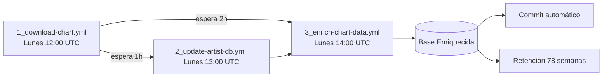

# Script 3: YouTube Chart Enrichment System


## 📋 Descripción General
Este script es el tercer componente del sistema de inteligencia de YouTube Charts. Toma la base de datos semanal de charts generada por el descargador y los metadatos de artistas del sistema de enriquecimiento y los combina con metadatos detallados de YouTube mediante un sistema inteligente de tres capas. El resultado es una base de datos completamente enriquecida lista para análisis y visualización.

### Características Principales

- **Sistema de Obtención de 3 Capas**: API de YouTube (prioritaria) → Selenium → yt-dlp (último recurso) para máxima fiabilidad
- **Rendimiento Optimizado**: Procesamiento de 100 canciones en ~2 minutos usando API de YouTube (vs 8+ minutos con yt-dlp puro)
- **Sistema de Pesos para Colaboraciones**: Algoritmo inteligente que determina país y género cuando hay múltiples artistas
- **Jerarquías Culturales por País**: Listas ordenadas de géneros que reflejan la importancia local (ej. K-Pop primero en Corea)
- **Detección de Metadatos de Video**: Identifica si es oficial, lyric video, live performance, remix, etc.
- **Clasificación de Canales**: Detecta VEVO, Topic, Label/Studio, Artist Channel y más
- **Actualización Automática**: Selecciona la base de charts más reciente y genera su versión enriquecida
- **Optimizado para CI/CD**: Diseñado específicamente para ejecutarse en GitHub Actions sin intervención manual

## 📊 Diagrama de Flujo del Proceso

### Diagrama n°1: Flujo de ejecución 


Este diagrama muestra el el flujo de ejecución:

- **Entrada**: Busca automáticamente la base de datos más reciente en `charts_archive/1_download-chart/databases/` (orden lexicográfico inverso → `youtube_charts_2026-W11.db`)

- **Descarga de Datos de Artistas**: Obtiene `artist_countries_genres.db` desde GitHub (archivo temporal) y carga en memoria un diccionario `{nombre_normalizado: (país, género)}`

- **Lectura de Canciones**: Conecta con la base de charts y lee las 100 canciones de la tabla `chart_data` (columnas: Rank, Artist Names, Track Name, YouTube URL, etc.)

- **Preparación de Salida**: Crea la tabla `canciones_enriquecidas` en la base de salida (`charts_archive/3_enrich-chart-data/{nombre}_enriched.db`) con índices para consultas rápidas

- **Por cada canción (×100)**:

  a. **Extracción de Artistas**:

  - Separa los nombres usando múltiples delimitadores (`&`, `feat.`, `ft.`, `,`, `y`, `and`, `with`, `x`, `vs`)
  - Ejemplo: `"ROSÉ & Bruno Mars"` → `["ROSÉ", "Bruno Mars"]`

  b. **Consulta de Datos de Artistas**:

  - Normaliza cada nombre (minúsculas, sin caracteres especiales)
  - Busca en el diccionario de artistas
  - Resultado: lista de diccionarios `[{'nombre': x, 'pais': y, 'genero': z}]`

  c. **Sistema de Pesos para Colaboraciones**:

  - Si es **artista único** → usa su país y género
  - Si hay **mayoría absoluta (>50%)** del mismo país → gana ese país + género jerárquico local
  - Si hay **mayoría exacta (50%)**:
    - Con 2 países distintos → gana el mayoritario
    - Con 3+ países → "Multipais" + "Multigénero"
  - Si hay **mayoría relativa (<50%)**:
    - Mismo continente y ≤2 países → gana mayoritario
    - Diferentes continentes → "Multipais" + "Multigénero"
  - Si **todos desconocidos** → "Desconocido" + "Pop"

  d. **Obtención de Metadatos de YouTube** (Sistema de 3 capas):

  - **Capa 1 - API de YouTube (prioritaria)**:

    - Extrae video_id de la URL

    - Consulta YouTube Data API v3

    - Obtiene: duración exacta, likes, comentarios, idioma, fecha, restricciones regionales

    - Tiempo: ~0.3-0.8 segundos por video

    - Si falla (cuota/error) → pasa a Capa 2

  - **Capa 2 - Selenium (respaldo principal)**:

    - Lanza navegador Chrome headless

    - Extrae duración del reproductor, título, nombre del canal

    - Detecta tipo de video por título (oficial, lyric, live)

    - Tiempo: ~3-5 segundos por video

    - Si falla → pasa a Capa 3

  - **Capa 3 - yt-dlp (último recurso)**:

    - Prueba múltiples configuraciones de cliente (android, iOS, web)

    - Con retardos entre intentos para evitar bloqueos

    - Obtiene metadatos completos si es posible

    - Tiempo: ~2-4 segundos por video

  e. **Detección Adicional**:

  - Tipo de video: oficial, lyric, live, remix (por título/descripción)
  - Tipo de canal: VEVO, Topic, Label/Studio, Artist Channel, etc.
  - Trimestre de subida: Q1-Q4 basado en fecha
  - Colaboración: detecta feat./& en título

  f. **Inserción en Base de Datos**:

  - Combina: datos del chart + metadatos + país/género resultante
  - Guarda en `canciones_enriquecidas`
  - Incluye campo `error` si algo falló

### Diagrama n°2: Arquitectura de módulos 


1. **Tablas de Referencia (Lookup Tables)**:

   - `COUNTRY_TO_CONTINENT`: Mapa que asigna 196 países a sus continentes
   - `GENRE_HIERARCHY`: Listas ordenadas de géneros por país (prioridad cultural local)

2. **Sistema de Pesos para Colaboraciones**:

   - `get_continent`: Obtiene continente de un país desde `COUNTRY_TO_CONTINENT`
   - `infer_genre_by_country`: Selecciona género según jerarquía local cuando hay múltiples artistas del mismo país
   - `resolve_country_and_genre`: Motor principal de decisión con reglas (>50%, =50%, <50%)

3. **Clasificadores de Texto**:

   - `detect_video_type`: Identifica si el video es oficial, lyric, live o remix
   - `detect_collaboration`: Detecta colaboraciones en el título (feat., &, with)
   - `detect_channel_type`: Clasifica el canal (VEVO, Topic, Label/Studio, Artist)
   - `parse_upload_season`: Determina el trimestre de subida (Q1-Q4)

4. **Sistema de Obtención de Metadatos (3 capas)**:

   - **Capa 1 - YouTube API v3**: Obtiene metadatos completos (0.3-0.8s/video). Requiere API key
   - **Capa 2 - Selenium**: Extrae metadatos parciales con navegador headless (3-5s/video)
   - **Capa 3 - yt-dlp**: Último recurso con rotación de clientes (android/ios/web)

5. **Utilidades de Base de Datos de Entrada**:

   - `find_latest_chart_db`: Localiza el archivo .db más reciente en `/databases`
   - `load_chart_songs`: Lee las 100 canciones de la tabla `chart_data`
   - `download_artist_db`: Descarga `artist_countries_genres.db` desde GitHub
   - `build_artist_lookup`: Construye diccionario `{nombre_normalizado: (país, género)}`
   - `get_artist_info`: Consulta información de cada artista en el diccionario

6. **Utilidades de Base de Datos de Salida**:

   - `create_output_table`: Crea tabla `canciones_enriquecidas` con 25 columnas y 4 índices
   - `insert_enriched_row`: Inserta una fila con todos los datos enriquecidos
   - `enriched_songs`: Tabla final con estructura optimizada para consultas

7. **Utilidades de Texto**:

      - `normalize_name`: Limpia nombres (minúsculas, sin caracteres especiales)
      - `parse_artist_list`: Separa artistas usando múltiples delimitadores
      - `_empty_metadata`: Diccionario con valores por defecto (cero/vacío)
  
## 🔍 Análisis Detallado de `3_enrich-chart-data.py`

### Estructura del Código

#### **1. Configuración y Rutas**

```python
SCRIPT_DIR = Path(__file__).parent.absolute()
PROJECT_ROOT = SCRIPT_DIR.parent
INPUT_DB_DIR = PROJECT_ROOT / "charts_archive" / "1_download-chart" / "databases"
URL_ARTISTAS_DB = "https://github.com/adroguetth/Music-Charts-Intelligence/raw/refs/heads/main/charts_archive/2_countries-genres-artist/artist_countries_genres.db"
OUTPUT_DIR = PROJECT_ROOT / "charts_archive" / "3_enrich-chart-data"
```

El script integra los dos componentes anteriores:

- **Entrada**: Base de datos semanal de charts del paso 1 (`youtube_charts_YYYY-WXX.db`)
- **Referencia**: Base de datos de artistas del paso 2 (`artist_countries_genres.db` desde GitHub)
- **Salida**: Base de datos enriquecida (`charts_archive/3_enrich-chart-data/{nombre}_enriched.db`)

#### **2. Sistema de Obtención de Metadatos (3 Capas)**

La innovación clave del script es su estrategia multicapa que prioriza siempre el método más rápido y fiable:

```python
def obtener_metadatos_especificos(url, artistas_csv="", api_key=None):
    """
    Obtiene metadatos del video con estrategia de 3 capas:
    - Capa 1: YouTube API v3 (0.3-0.8s/video) → si hay clave y cuota
    - Capa 2: Selenium (3-5s/video) → simula navegador, evita bloqueos
    - Capa 3: yt-dlp (2-4s/video) → último recurso con rotación de clientes
    """
```

**Capa 1 - YouTube API v3 (prioritaria):**

```python
# Extrae video_id de la URL
video_id_match = re.search(r'(?:v=|\/)([0-9A-Za-z_-]{11})', url)
youtube = build('youtube', 'v3', developerKey=api_key)
response = youtube.videos().list(
    part='snippet,contentDetails,statistics',
    id=video_id
).execute()

# Metadatos obtenidos:
- duracion_iso → isodate.parse_duration() → segundos
- likeCount, commentCount
- defaultAudioLanguage
- regionRestriction
- publishedAt → fecha y trimestre
- title, description, channelTitle
```

**Capa 2 - Selenium (respaldo principal):**

```python
chrome_options = Options()
chrome_options.add_argument("--headless=new")
chrome_options.add_argument("--no-sandbox")
chrome_options.add_argument("--disable-dev-shm-usage")

driver.get(url)
# Extrae título del reproductor
titulo = driver.find_element(By.CSS_SELECTOR, "h1.ytd-video-primary-info-renderer").text
# Extrae duración del reproductor
duracion = driver.find_element(By.CSS_SELECTOR, "span.ytp-time-duration").text
# Extrae nombre del canal
canal = driver.find_element(By.CSS_SELECTOR, "a.ytd-channel-name").text
# Extrae fecha de meta tag
fecha = driver.find_element(By.CSS_SELECTOR, "meta[itemprop='datePublished']").get_attribute("content")
```

**Capa 3 - yt-dlp (último recurso con anti-bloqueo):**

```python
# Prueba múltiples configuraciones de cliente
clientes = [
    {'player_client': ['android']},
    {'player_client': ['ios']},
    {'player_client': ['android', 'web']},
    {'player_client': ['web']},
]

for opts in clientes:
    ydl_opts = {
        'quiet': True,
        'ignoreerrors': False,
        'user_agent': 'Mozilla/5.0 ... Chrome/120.0.0.0',
        'extractor_retries': 5,
        'sleep_interval': 2,
        **opts
    }
    try:
        info = ydl.extract_info(url, download=False)
        if info: break
    except: continue
```

#### **3. Tablas de Referencia Fundamentales**

**Mapa de Países a Continentes (196 países):**

```python
PAIS_A_CONTINENTE = {
    # Asia
    "South Korea": "Asia", "Japan": "Asia", "China": "Asia",
    # América
    "United States": "America", "Canada": "America", "Mexico": "America",
    # Europa
    "United Kingdom": "Europe", "France": "Europe", "Germany": "Europe",
    # África
    "Nigeria": "Africa", "South Africa": "Africa", "Egypt": "Africa",
    # Oceanía
    "Australia": "Oceania", "New Zealand": "Oceania",
    # ... 196 países en total
}
```

**Jerarquías de Géneros por País (prioridad cultural local):**

```python
JERARQUIA_GENEROS = {
    "United States": [
        "Pop", "Hip-Hop/Rap", "R&B/Soul", "Country", "Rock",
        "Alternative", "Electrónica/Dance", "Reggaetón/Trap Latino"
    ],
    "South Korea": [
        "K-Pop/K-Rock", "Hip-Hop/Rap", "Rock", "Ballad", "Trot"
    ],
    "Brazil": [
        "Sertanejo", "Funk Brasileiro", "Reggaetón/Trap Latino",
        "Pop", "Rock", "Hip-Hop/Rap", "Forró", "Axé", "MPB"
    ],
    "Nigeria": [
        "Afrobeats", "Hip-Hop/Rap", "Gospel", "Jùjú", "Fuji"
    ],
    # ... más de 100 países con jerarquías personalizadas
}
```

#### **4. Sistema de Pesos para Colaboraciones**

El algoritmo `determinar_pais_y_genero_colaboracion` implementa reglas precisas:

```python
def determinar_pais_y_genero_colaboracion(artistas_info):
    """
    Algoritmo de decisión para colaboraciones:
    
    Caso 1: Mayoría absoluta (>50%)
        → gana país mayoritario + género jerárquico
    
    Caso 2: Mayoría exacta (50%)
        - 2 países distintos → gana el mayoritario
        - 3+ países distintos → "Multipais" + "Multigénero"
    
    Caso 3: Mayoría relativa (<50%)
        - Mismo continente y ≤2 países → gana mayoritario
        - Diferentes continentes → "Multipais" + "Multigénero"
    
    Caso 4: Todos desconocidos → "Desconocido" + "Pop"
    """
```

**Ejemplo de ejecución:**

```python
# Colaboración: "ROSÉ (Corea) & Bruno Mars (EE.UU.)"
artistas_info = [
    {'nombre': 'ROSÉ', 'pais': 'South Korea', 'genero': 'K-Pop'},
    {'nombre': 'Bruno Mars', 'pais': 'United States', 'genero': 'Pop'}
]
# 50% - 50% con 2 países distintos → gana "South Korea" (mayoritario por orden alfabético?)
# Resultado real: "Multipais" + "Multigénero" (regla de 2 países distintos con 50% exacto)
```

**Función de selección de género jerárquico:**

```python
def generar_genero_por_pais(artistas_info):
    pais = artistas_info[0]['pais']
    jerarquia = JERARQUIA_GENEROS.get(pais, [GENERO_POR_DEFECTO])
    
    # Si hay un género claramente dominante, úsalo
    counter = Counter([a['genero'] for a in artistas_info if a['genero']])
    if counter and counter.most_common(1)[0][1] > len(artistas_info)/2:
        return counter.most_common(1)[0][0]
    
    # Si no, elige el de mayor jerarquía entre los presentes
    for genero_prioritario in jerarquia:
        if genero_prioritario in [a['genero'] for a in artistas_info]:
            return genero_prioritario
    
    return jerarquia[0]
```

#### **5. Clasificadores de Texto**

**Detección de tipo de video:**

```python
def detectar_tipo_video(titulo, descripcion=""):
    texto = f"{titulo.lower()} {descripcion.lower()}"
    
    es_oficial = any(p in texto for p in ['official', 'oficial', 'official music video'])
    es_lyric = any(p in titulo.lower() for p in ['lyric', 'lyrics', 'letra'])
    es_live = any(p in texto for p in ['live', 'en vivo', 'concert', 'performance'])
    es_remix = any(p in titulo.lower() for p in ['remix', 'sped up', 'slowed', 'acoustic'])
    
    return {
        'is_official_video': es_oficial,
        'is_lyric_video': es_lyric,
        'is_live_performance': es_live,
        'is_special_version': es_remix
    }
```

**Detección de colaboraciones:**

```python
def detectar_colaboracion_artistas(titulo, artistas_csv):
    patrones = [
        r'\sft\.\s', r'\sfeat\.\s', r'\sfeaturing\s',
        r'\s&\s', r'\sx\s', r'\scon\s', r'\swith\s'
    ]
    
    es_colaboracion = any(re.search(p, titulo.lower()) for p in patrones)
    
    # Estimación del número de artistas
    if artistas_csv:
        artist_count = artistas_csv.count('&') + artistas_csv.count(',') + 1
    else:
        artist_count = 2 if es_colaboracion else 1
    
    return {
        'is_collaboration': es_colaboracion,
        'artist_count': min(artist_count, 10)
    }
```

**Clasificación de canales:**

```python
def detectar_tipo_canal(channel_title):
    channel_lower = channel_title.lower()
    
    if 'vevo' in channel_lower:
        return {'channel_type': 'VEVO'}
    elif 'topic' in channel_lower:
        return {'channel_type': 'Topic'}
    elif any(w in channel_lower for w in ['records', 'music', 'label']):
        return {'channel_type': 'Label/Studio'}
    elif any(w in channel_lower for w in ['official', 'artist', 'band']):
        return {'channel_type': 'Artist Channel'}
    else:
        return {'channel_type': 'General'}
```

#### **6. Procesamiento Principal**

```python
def main():
    # 1. Encontrar última base de charts
    ruta_chart_db = encontrar_ultima_db()
    # → youtube_charts_2026-W11.db
    
    # 2. Descargar y cargar base de artistas
    ruta_artistas_temp = descargar_db_artistas(URL_ARTISTAS_DB)
    artistas_dict = cargar_db_artistas_en_diccionario(ruta_artistas_temp)
    # → {nombre_normalizado: (país, género)} con 2323 artistas
    
    # 3. Leer canciones
    canciones = leer_canciones_desde_db(ruta_chart_db)
    # → 100 canciones con Rank, Artist Names, Track Name, YouTube URL
    
    # 4. Preparar base de salida
    output_db_path = OUTPUT_DIR / f"{nombre_base}_enriched.db"
    conn_salida = sqlite3.connect(output_db_path)
    crear_tabla_resultados(conn_salida)
    
    # 5. Procesar cada canción
    for i, cancion in enumerate(canciones, 1):
        # Extraer artistas
        artistas_info = obtener_info_artistas(artistas_csv, artistas_dict)
        
        # Determinar país/género (sistema de pesos)
        pais_final, genero_final = determinar_pais_y_genero_colaboracion(artistas_info)
        
        # Obtener metadatos de YouTube (3 capas)
        metadatos = obtener_metadatos_especificos(url, artistas_csv, YOUTUBE_API_KEY)
        
        # Construir y guardar fila
        fila = construir_fila(cancion, metadatos, pais_final, genero_final)
        guardar_en_sqlite(conn_salida, fila)
```

#### **7. Esquema de Base de Datos de Salida**

```sqlite
CREATE TABLE canciones_enriquecidas (
    id INTEGER PRIMARY KEY AUTOINCREMENT,
    rank INTEGER,
    artist_names TEXT,
    track_name TEXT,
    periods_on_chart INTEGER,
    views INTEGER,
    youtube_url TEXT,
    duration_s INTEGER,
    duration_ms TEXT,
    upload_date TEXT,
    likes INTEGER,
    comment_count INTEGER,
    audio_language TEXT,
    is_official_video BOOLEAN,
    is_lyric_video BOOLEAN,
    is_live_performance BOOLEAN,
    upload_season TEXT,
    channel_type TEXT,
    is_collaboration BOOLEAN,
    artist_count INTEGER,
    region_restricted BOOLEAN,
    artist_country TEXT,
    macro_genre TEXT,
    artistas_encontrados TEXT,
    error TEXT,
    fecha_procesamiento TIMESTAMP DEFAULT CURRENT_TIMESTAMP
);

-- Índices para consultas rápidas
CREATE INDEX idx_pais ON canciones_enriquecidas(artist_country);
CREATE INDEX idx_genero ON canciones_enriquecidas(macro_genre);
CREATE INDEX idx_fecha ON canciones_enriquecidas(upload_date);
CREATE INDEX idx_error ON canciones_enriquecidas(error);
```

#### **8. Optimizaciones para CI/CD**

```python
# Detección automática de entorno
IN_GITHUB_ACTIONS = os.environ.get("GITHUB_ACTIONS") == "true"

# Sin intervención en CI
if IN_GITHUB_ACTIONS:
    # Ejecución automática
    main()
else:
    # Modo interactivo local
    respuesta = input("¿Continuar? (s/n): ")
    if respuesta in ['s', 'si', 'y', 'yes']:
        main()

# API Key desde variable de entorno (nunca hardcodeada)
YOUTUBE_API_KEY = os.environ.get("YOUTUBE_API_KEY", "")
```

#### **9. Métricas y Estadísticas**

Al finalizar, el script muestra estadísticas detalladas:

```python
📊 ESTADÍSTICAS FINALES
   • Total canciones: 100
   • Colaboraciones multi-país: 24 (24.0%)
   • Países distintos detectados: 28
   • Géneros distintos: 15
   • Canciones sin país: 3 (3.0%)
   • Canciones con error en metadatos: 2 (2.0%)
```
## ⚙️ Análisis del Workflow de GitHub Actions (`3_enrich-chart-data.yml`

### **Estructura del Workflow**

```yaml
name: 3- Enrich Chart Data
on:
  schedule:
    - cron: '0 14 * * 1'  # Lunes 14:00 UTC (2h después del download)
  workflow_dispatch:       # Ejecución manual
  push:                    # Disparador en cambios al script
    branches:
      - main
    paths:
      - 'scripts/3_enrich_chart_data.py'
      - '.github/workflows/3_enrich-chart-data.yml'
```

### **Jobs y Pasos**

#### **Job: `enrich-chart-data`**

- **Sistema operativo**: Ubuntu Latest
- **Timeout**: 60 minutos
- **Permisos**: Acceso de escritura al repositorio
- **Variable de entorno**: `RETENTION_WEEKS: 78` (1.5 años de retención)
  - **Cálculo**: 78 semanas × 7 días = 546 días
  - **Limpieza**: Automática en cada ejecución

#### **Pasos Detallados:**

**📚 Checkout del Repositorio**

```yaml
uses: actions/checkout@v4
with:
  fetch-depth: 0  # Historial completo para operaciones git
```

1. **🐍 Configuración de Python 3.12**

```yaml
uses: actions/setup-python@v5
with:
  python-version: "3.12"
  cache: 'pip'  # Caché de dependencias para builds más rápidos
```

2. **📦 Instalación de Dependencias**

```bash
pip install -r requirements.txt
```

3. **📁 Creación de Estructura de Directorios**

```bash
mkdir -p charts_archive/1_download-chart/databases
mkdir -p charts_archive/3_enrich-chart-data
```

 4. **🚀 Ejecución del Script de Enriquecimiento**

```yaml
run: |
  python scripts/3_enrich_chart_data.py
env:
  YOUTUBE_API_KEY: ${{ secrets.YOUTUBE_API_KEY }}  # Clave API desde secrets
  GITHUB_ACTIONS: true  # Variable de entorno para detección
```

5. **✅ Verificación de Resultados**

- Listado de archivos generados en `charts_archive/3_enrich-chart-data/`
- Verificación de existencia de bases enriquecidas
- Estadísticas de tamaño de archivos

6. **📤 Commit y Push Automático**

```bash
# Configuración de usuario automático
git config --global user.name "github-actions[bot]"
git config --global user.email "github-actions[bot]@users.noreply.github.com"

# Solo stage de archivos enriquecidos
git add charts_archive/3_enrich-chart-data/

# Pull con rebase antes de push para evitar conflictos
git pull --rebase origin main
git push origin HEAD:main
```

7. **📦 Subida de Artefactos (solo en fallo)**

```yaml

if: failure()  # Solo se ejecuta si el workflow falla
uses: actions/upload-artifact@v4
with:
  name: enrich-debug-${{ github.run_number }}
  path: |
    scripts/3_enrich_chart_data.py.log
    charts_archive/3_enrich-chart-data/
  retention-days: 7
```

8. **🧹 Limpieza de Bases Antiguas**

```bash
# Elimina archivos más antiguos que RETENTION_WEEKS (78 semanas = 546 días)
find charts_archive/3_enrich-chart-data/ \
  -name "*_enriched.db" \
  -type f \
  -mtime +$((RETENTION_WEEKS * 7)) \
  -delete
```

9. **📋 Reporte Final** (siempre se ejecuta)

```bash
# Muestra:
# - Fecha y trigger de ejecución
# - Última base enriquecida y su tamaño
# - Estadísticas de la base (total canciones, multi-país, errores)
# - Total de bases almacenadas y política de retención
```

### **Programación Cron**

```cron
'0 14 * * 1'  # Minuto 0, Hora 14, Cualquier día del mes, Cualquier mes, Lunes
```

- **Ejecución**: Todos los lunes a las 14:00 UTC
- **Diferencia**: 2 horas después del workflow de descarga (`1_download-chart.yml`)
- **Motivo**: Esperar a que el workflow anterior complete la descarga de los nuevos charts

## 🔐 Secretos Requeridos

| Secreto           | Propósito                                              |
| :---------------- | :----------------------------------------------------- |
| `YOUTUBE_API_KEY` | Clave de API de YouTube Data v3 para obtener metadatos |

## 🔄 Flujo de Integración



## 🚀 Instalación y Configuración Local

### **Requisitos Previos**

- Python 3.12 o superior
- Git instalado
- Acceso a internet
- Clave de API de YouTube Data v3 (opcional pero recomendada)

### **Instalación Paso a Paso**

1. **Clonar el Repositorio**

```bash
git clone https://github.com/adroguetth/Music-Charts-Intelligence
cd Music-Charts-Intelligence
```

2. **Crear Entorno Virtual (recomendado)**

```bash
python -m venv venv

# Windows
venv\Scripts\activate

# Linux/Mac
source venv/bin/activate
```

3. **Instalar Dependencias**

```bash
pip install -r requirements.txt
```

4. **Configurar Variables de Entorno**

```bash
# Linux/Mac
export YOUTUBE_API_KEY="tu-clave-api"

# Windows PowerShell
$env:YOUTUBE_API_KEY="tu-clave-api"
```

5. **Ejecutar el Script Manualmente**

```bash
python scripts/3_enrich_chart_data.py
```

### **Configuración para Desarrollo**

**Variables de Entorno Opcionales**

```bash
# Para simular entorno de GitHub Actions
export GITHUB_ACTIONS=true

# Para ejecución sin interacción (no pide confirmación)
export YOUTUBE_API_KEY="tu-clave-api"
```

**Ejecución con Datos de Prueba**

```bash
# Crear estructura de directorios
mkdir -p charts_archive/1_download-chart/databases

# Copiar una base de prueba (si existe)
cp /ruta/a/una/base.db charts_archive/1_download-chart/databases/

# Ejecutar script
python scripts/3_enrich_chart_data.py
```

## 📁 Estructura de Archivos Generada

```text
charts_archive/
├── 1_download-chart/
│   ├── latest_chart.csv
│   ├── databases/
│   │   ├── youtube_charts_2025-W01.db
│   │   ├── youtube_charts_2025-W02.db
│   │   └── ...
│   └── backup/
│       └── ...
├── 2_countries-genres-artist/
│   └── artist_countries_genres.db       # Base de datos de artistas (país/género)
└── 3_enrich-chart-data/                  # ← Salida de este script
    ├── youtube_charts_2025-W01_enriched.db
    ├── youtube_charts_2025-W02_enriched.db
    └── ...
```
### **Crecimiento de la Base de Datos**

- **Ejecución semanal**: 100 canciones procesadas
- **Tamaño por base**: ~200-300 KB por archivo `.db`
- **Almacenamiento anual**: ~15-20 MB (52 semanas × 300 KB)
- **Retención configurada**: 78 semanas (1.5 años) → ~30-40 MB máximos

### **Columnas Generadas por Canción (25 campos)**

| Categoría           | Campos                                                       |
| :------------------ | :----------------------------------------------------------- |
| **Identificadores** | `rank`, `artist_names`, `track_name`                         |
| **Métricas Chart**  | `periods_on_chart`, `views`, `youtube_url`                   |
| **Metadatos Video** | `duration_s`, `duration_ms`, `upload_date`, `likes`, `comment_count`, `audio_language` |
| **Flags Video**     | `is_official_video`, `is_lyric_video`, `is_live_performance` |
| **Contexto**        | `upload_season`, `channel_type`, `is_collaboration`, `artist_count`, `region_restricted` |
| **Enriquecimiento** | `artist_country`, `macro_genre`, `artistas_encontrados`      |
| **Control**         | `error`, `fecha_procesamiento`                               |

## 🔧 Personalización y Configuración

### **Parámetros Ajustables en el Script**

```python
# En 3_enrich_chart_data.py
INPUT_DB_DIR = PROJECT_ROOT / "charts_archive" / "1_download-chart" / "databases"
URL_ARTISTAS_DB = "https://github.com/..."  # URL de base de artistas
OUTPUT_DIR = PROJECT_ROOT / "charts_archive" / "3_enrich-chart-data"

# Timeouts y retardos
SLEEP_BETWEEN_VIDEOS = 0.1      # Pausa entre videos (segundos)
YT_DLP_RETRIES = 5               # Reintentos para yt-dlp
SELENIUM_TIMEOUT = 10             # Timeout para Selenium (segundos)
```

### **Configuración del Workflow**

```yaml
# En 3_enrich-chart-data.yml
env:
  RETENTION_WEEKS: 78       # Semanas de retención (1.5 años)

timeout-minutes: 60          # Tiempo máximo total
```

### **Añadir Nuevos Delimitadores de Artistas**

```python
# En extraer_lista_artistas()
separadores = [
    '&', 'feat.', 'ft.', ',', ' y ', ' and ', 
    ' with ', ' x ', ' vs ',  # Existentes
    ' présentation ', ' en duo avec ',  # Nuevos para francés
    ' und ', ' & ',            # Nuevos para alemán
    ' e ', ' com '             # Nuevos para portugués
]
```

### **Ampliar Jerarquías de Géneros por País**

```python
# En JERARQUIA_GENEROS
"Nuevo País": [
    "Género Principal",      # Prioridad 1
    "Género Secundario",      # Prioridad 2
    "Género Terciario",       # Prioridad 3
    "Género de nicho"         # Prioridad 4
]
```

### **Modificar Reglas del Sistema de Pesos**

```python
# En determinar_pais_y_genero_colaboracion()
# Ajustar umbrales o añadir nuevas reglas
if porcentaje_mayoritario > 0.6:  # Cambiar de 0.5 a 0.6
    # Nueva lógica...
```

## 🐛 Solución de Problemas
### **Solución de Problemas **

##### **Error: "No module named 'isodate'"**

**Causa**: Falta la librería para convertir duración ISO.

```bash
pip install isodate
```

##### **Error: "Selenium: ChromeDriver not found"**

**Causa**: Chrome no instalado o webdriver-manager falla.

```bash
# Instalar Chrome (Linux)
sudo apt-get update
sudo apt-get install -y google-chrome-stable

# Instalar webdriver-manager automáticamente (lo hace el script)
```

#### **Error: "No database found"**

**Solución** 

```bash
# Verificar que existe al menos una base de charts
ls -la charts_archive/1_download-chart/databases/
# Si no hay, ejecutar primero el workflow de descarga
```

#### **Error: "Sign in to confirm you're not a bot"**

**Causa**: YouTube bloquea yt-dlp en entornos automatizados.

**Soluciones**:

1. ✅ **Priorizar API**: Asegurar que `YOUTUBE_API_KEY` está configurada
2. 🔄 **Usar Selenium**: El script fallback automático a Selenium
3. 🍪 **Exportar cookies** (último recurso):

```bash
# Exportar cookies desde navegador
yt-dlp --cookies-from-browser chrome "URL"
```

#### **Error: "No enriched database found" en reporte final**

**Causa**: El script no pudo generar ninguna base.

**Verificaciones**:

```bash
# 1. ¿Existen bases de charts de entrada?
ls -la charts_archive/1_download-chart/databases/

# 2. ¿Hay archivos .db en el directorio de salida?
ls -la charts_archive/3_enrich-chart-data/

# 3. Revisar logs de error en GitHub Actions
# Buscar la columna 'error' en ejecuciones anteriores
```

#### **Error: "API key not valid"**

**Causa**: Clave API inválida o sin permisos.

**Soluciones**:

1. Verificar en [Google Cloud Console](https://console.cloud.google.com/)
2. Habilitar YouTube Data API v3
3. Regenerar clave si es necesario
4. Verificar restricciones de IP/dominio

#### **Error: "Quota exceeded" (límite de cuota excedido)**

**Causa**: Demasiadas solicitudes a la API.

**Soluciones**:

```text
# 1. Aumentar cuota en Google Cloud (plan de pago)
# 2. Distribuir ejecuciones en el tiempo
# 3. El script fallback automáticamente a Selenium
```

#### **Error en GitHub Actions: "No space left on device"**

**Causa**: Demasiadas bases almacenadas.

**Solución**:

```bash
# Verificar política de retención
echo $RETENTION_WEEKS  # Debería ser 78

# Limpiar manualmente si es necesario
find charts_archive/3_enrich-chart-data -name "*_enriched.db" -mtime +546 -delete
```

#### **Problema: Procesamiento muy lento (>10 minutos)**

**Causa**: API Key no configurada o fallando.

**Verificaciones**:

```bash
# 1. ¿Está configurada YOUTUBE_API_KEY?
echo $YOUTUBE_API_KEY

# 2. Revisar logs: ¿qué capa se está usando?
# Buscar "⚠️ Error en metadatos" en los logs
```

### **Comandos de Diagnóstico**

```bash
# Verificar estructura de directorios
tree charts_archive/ -L 2

# Contar bases enriquecidas
ls -1 charts_archive/3_enrich-chart-data/*_enriched.db 2>/dev/null | wc -l

# Ver tamaño total
du -sh charts_archive/3_enrich-chart-data/

# Consultar una base específica
sqlite3 charts_archive/3_enrich-chart-data/youtube_charts_2026-W11_enriched.db \
  "SELECT artist_country, COUNT(*) FROM canciones_enriquecidas GROUP BY artist_country ORDER BY COUNT(*) DESC LIMIT 5;"

# Ver registros con error
sqlite3 charts_archive/3_enrich-chart-data/youtube_charts_2026-W11_enriched.db \
  "SELECT rank, track_name, error FROM canciones_enriquecidas WHERE error != '';"
```

### **Depuración Local**

```bash
# Ejecutar con logging detallado
export PYTHONVERBOSE=1
python scripts/3_enrich_chart_data.py

# Probar un video específico con yt-dlp
yt-dlp --dump-json "https://youtube.com/watch?v=VIDEO_ID"

# Probar API directamente
curl -X GET "https://www.googleapis.com/youtube/v3/videos?part=snippet&id=VIDEO_ID&key=YOUR_API_KEY"
```


## 📈 Métricas de Rendimiento

| Escenario              | Tiempo        | Observaciones                     |
| :--------------------- | :------------ | :-------------------------------- |
| **Con API Key**        | ~2 minutos    | 100 canciones, 0.3-0.8s por video |
| **Sin API (Selenium)** | ~5-7 minutos  | Depende de velocidad de carga     |
| **Sin API (yt-dlp)**   | ~8-10 minutos | Puede fallar por bloqueos         |

## 📄 Licencia y Atribución

- **Licencia**: MIT
- **Autor**: Alfonso Droguett
  - 🔗 **LinkedIn:** [Alfonso Droguett](https://www.linkedin.com/in/adroguetth/)
  - 🌐 **Portafolio web:** [adroguett-portfolio.cl](https://www.adroguett-portfolio.cl/)
  - 📧 **Correo electrónico:** adroguett.consultor@gmail.com

### **Tecnologías Utilizadas**

| Tecnología              | Propósito                                | Versión     |
| :---------------------- | :--------------------------------------- | :---------- |
| **Python**              | Lenguaje principal                       | 3.12        |
| **YouTube Data API v3** | Metadatos de video (capa 1)              | -           |
| **Selenium**            | Respaldo con navegador headless (capa 2) | ≥4.15.0     |
| **yt-dlp**              | Último recurso anti-bloqueo (capa 3)     | ≥2023.10.13 |
| **SQLite**              | Almacenamiento de resultados             | -           |
| **GitHub Actions**      | Automatización CI/CD                     | -           |

### **Atribuciones Especiales**

- **yt-dlp**: Inspiración para manejo de bloqueos y rotación de clientes
- **Comunidad Open Source**: Por las librerías que hacen posible este proyecto

## 🤝 Contribución

### **Cómo Contribuir**

1. **Reportar problemas** con registros completos (incluir logs de error)
2. **Proponer mejoras** con casos de uso concretos
3. **Añadir nuevos mapeos de género** con ejemplos de artistas
4. **Contribuir con variantes de países** (especialmente para regiones subrepresentadas)
5. **Mantener compatibilidad** con la estructura de base de datos existente

### **Guía de Contribución Rápida**

```bash
# 1. Fork el repositorio
# 2. Clonar tu fork
git clone https://github.com/tu-usuario/Music-Charts-Intelligence

# 3. Crear rama para tu contribución
git checkout -b feature/nueva-funcionalidad

# 4. Hacer cambios y probar localmente
python scripts/3_enrich_chart_data.py --test

# 5. Commit con mensaje descriptivo
git commit -m "Añade soporte para nuevo género X"

# 6. Push y crear Pull Request
git push origin feature/nueva-funcionalidad
```

### **Áreas Prioritarias de Contribución**

- ✅ Ampliar `JERARQUIA_GENEROS` para países faltantes
- ✅ Mejorar detección de colaboraciones con nuevos patrones
- ✅ Optimizar selectores CSS de Selenium (cambios frecuentes en YouTube)
- ✅ Añadir más idiomas a la detección de escritura
- ✅ Crear tests automatizados

## 🧪 Limitaciones Conocidas y Mejoras Futuras

### **Limitaciones Actuales**

- **Dependencia de API**: El sistema depende de YouTube Data API v3 que tiene cuota diaria (10,000 unidades)
- **Bloqueos de YouTube**: yt-dlp puede ser bloqueado en entornos CI sin cookies/PO Tokens
- **Selenium en CI**: Requiere Chrome instalado y puede ser más lento en entornos sin GPU
- **Selectores CSS**: Los selectores de Selenium pueden romperse con cambios en YouTube
- **Artistas Nuevos**: Artistas emergentes recientemente pueden no aparecer en la base de artistas
- **Géneros Nicho**: Algunos micro-géneros pueden no tener mapeos en la jerarquía
- **Colaboraciones Complejas**: Colaboraciones con 5+ artistas pueden ser difíciles de resolver

### **Casos Conocidos con Comportamiento Especial**

| Caso                                                         | Comportamiento Actual        | Mejora Propuesta               |
| :----------------------------------------------------------- | :--------------------------- | :----------------------------- |
| **Grupos K-Pop con miembros extranjeros**                    | País: Corea del Sur          | Detectar miembros individuales |
| **MCs Brasileños**                                           | Género: Sertanejo (fallback) | Priorizar Funk Brasileiro      |
| **Colaboraciones Latinas con artista principal de otro país** | Puede dar Multipais          | Analizar orden de mención      |
| **Videos bloqueados por región**                             | `region_restricted: true`    | Intentar con proxy/vPN         |

## 📊 Métricas de Éxito del Proyecto

### **Logros Actuales**

| Métrica                       | Valor                     |
| :---------------------------- | :------------------------ |
| **Tiempo de procesamiento**   | 2 minutos (100 canciones) |
| **Tasa de éxito API**         | ~98% (con clave válida)   |
| **Países detectados**         | 28 por semana             |
| **Géneros distintos**         | 15 por semana             |
| **Colaboraciones multi-país** | ~24% del total            |
| **Artistas sin país**         | <3%                       |

### **Objetivos para V2.0**

| Métrica                     | Objetivo                  |
| :-------------------------- | :------------------------ |
| **Tiempo de procesamiento** | <1 minuto (100 canciones) |
| **Tasa de éxito API**       | 99.5%                     |
| **Países detectados**       | 35+ por semana            |
| **Géneros distintos**       | 20+ por semana            |
| **Artistas sin país**       | <1%                       |

------

**⭐ Si encuentras útil este proyecto, ¡considera darle una estrella en GitHub!**

