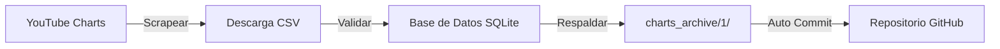
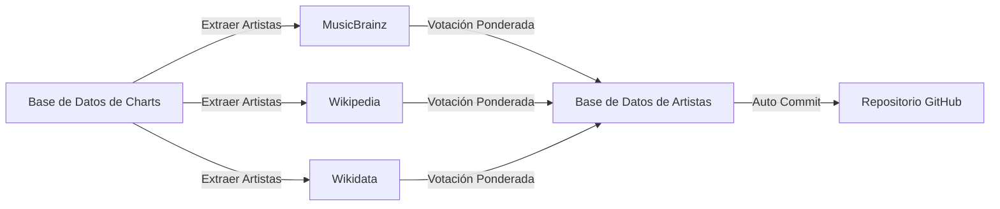

# 🎵 Music Charts Intelligence System

 
[](#) 
[](#) 
[](#)
[](#) 

## 📋 Descripción General

Este repositorio contiene dos scripts de Python que trabajan juntos para construir una base de datos musical completa:

| Script                   | Propósito                                                    | Tecnologías Clave            | **🇬🇧 Documentación en Inglés**                               | **🇪🇸 Documentación en Español**                              |
| :----------------------- | :----------------------------------------------------------- | :--------------------------- | :----------------------------------------------------------- | :----------------------------------------------------------- |
| **1_download.py**        | Descarga semanal de YouTube Charts (100 canciones) y almacena en SQLite | Playwright, Pandas, SQLite   | [README](https://github.com/adroguetth/Music-Charts-Intelligence/blob/main/Documentation_EN/1_download.md) <br/> [PDF](https://drive.google.com/file/d/11ANLX6PbK_eIzvHLPqL1rm9NY9rOshhD/view?usp=sharing) | [README](https://github.com/adroguetth/Music-Charts-Intelligence/blob/main/Documentation_ES/1_download.md) <br/> [PDF](https://drive.google.com/file/d/1SdLvJnxcKxmQYmLlwoYttHr2Izud4iE5/view?usp=sharing) |
| **2_build_artist_db.py** | Enriquece artistas con país y género desde MusicBrainz, Wikipedia, Wikidata | Requests, SQLite, NLP propio | [README](https://github.com/adroguetth/Music-Charts-Intelligence/blob/main/Documentation_EN/2_build_artist_db.md) <br/> [PDF](https://drive.google.com/file/d/1viUAxZ7k-qeYYbyvZf2OaP20AfLOgKh2/view?usp=drive_link) | [README](https://github.com/adroguetth/Music-Charts-Intelligence/blob/main/Documentation_ES/2_build_artist_db.md) <br/> [PDF](https://drive.google.com/file/d/1WBHBreKeVToTBygSyCuYsHQUr_zSl3BT/view?usp=drive_link) |

## 🚀 Inicio Rápido

### Requisitos Previos

- Python 3.7+
- Git instalado

### Instalación

```bash
# Clonar repositorio
git clone <tu-url-del-repositorio>
cd <nombre-del-repositorio>

# Crear entorno virtual
python -m venv venv
source venv/bin/activate  # Linux/Mac
# venv\Scripts\activate    # Windows

# Instalar dependencias
pip install -r requirements.txt

# Solo para el Script 1 (navegador Playwright)
python -m playwright install chromium
```

## 🔄 Cómo Funciona

### Script 1: Descargar YouTube Charts



**Qué hace:**

- Se ejecuta cada lunes a las 12:00 UTC vía GitHub Actions
- Descarga CSV completo de 100 canciones con medidas anti-detección
- Almacena datos semanales en bases de datos SQLite versionadas
- Crea respaldos automáticos antes de cada actualización
- Usa datos de muestra si la descarga falla

### Script 2: Enriquecer Datos de Artistas



**Qué hace:**

- Se ejecuta después del Script 1 (lunes 14:00 UTC)
- Consulta múltiples APIs para cada artista
- Detecta país (ciudades, gentilicios, más de 30K términos)
- Clasifica género (más de 200 macro-géneros, 5K+ mapeos)
- Solo actualiza datos faltantes, nunca sobrescribe
- Usa caché inteligente para evitar llamadas redundantes

## 📁 Estructura de Salida

```text
charts_archive/
├── 1_download-chart/              # Script 1 output
│   ├── databases/
│   │   ├── youtube_charts_2025-W01.db
│   │   ├── youtube_charts_2025-W02.db
│   │   └── ...
│   └── backup/                     # Automatic backups
└── 2_artist_countries_genres/      # Script 2 output
    └── artist_countries_genres.db   # Enriched artist data
```

### Esquema de Base de Datos

**BD del Script 1 (tabla `chart_data`):**

| Columna      | Descripción                 |
| :----------- | :-------------------------- |
| Rank         | Posición en el chart        |
| Track Name   | Título de la canción        |
| Artist Names | Artista(s)                  |
| Views        | Número de vistas            |
| week_id      | Identificador ISO de semana |

**BD del Script 2 (tabla `artist`):**

| Columna     | Descripción                         | Ejemplo         |
| :---------- | :---------------------------------- | :-------------- |
| name        | Nombre del artista (clave primaria) | "BTS"           |
| country     | País canónico                       | "Corea del Sur" |
| macro_genre | Género principal                    | "K-Pop/K-Rock"  |

------

## ⚙️ Automatización con GitHub Actions

Ambos scripts están completamente automatizados vía GitHub Actions:

### Workflow del Script 1

- **Programación**: Cada lunes, 12:00 UTC
- **Disparadores**: Manual, o cambios en los scripts
- **Tiempo máximo**: 30 minutos

### Workflow del Script 2

- **Programación**: Cada lunes, 14:00 UTC
- **Disparadores**: Después de que el Script 1 complete, o manual
- **Tiempo máximo**: 60 minutos (permite límites de tasa de API)

Ambos workflows automáticamente hacen commit de los cambios al repositorio.

------

## 🛠️ Configuración

### Parámetros del Script 1 (`1_download.py`)

```python
RETENTION_DAYS = 7      # Retención de respaldos (días)
RETENTION_WEEKS = 52    # Retención de bases de datos (semanas)
TIMEOUT = 120000        # Tiempo de espera del navegador (ms)
```


### Parámetros del Script 2 (`2_build_artist_db.py`)

```python
MIN_CANDIDATES = 3      # Mínimo de candidatos antes de buscar en Wikipedia
RETRY_DELAY = 0.5       # Retraso entre llamadas API (segundos)
DEFAULT_TIMEOUT = 10    # Tiempo de espera de API (segundos)
```


## 📊 Ejemplo de Salida

Después de ejecuciones exitosas, verás:

- Bases de datos semanales con 100 canciones cada una
- Base de datos de artistas creciendo de 10 a 50 nuevos artistas por semana
- Commits automáticos con mensajes descriptivos

```text
✅ Script 1: Actualización YouTube Chart 2025-03-17 (Semana 2025-W11)
✅ Script 2: Actualización base de datos de artistas 2025-03-17 (147 nuevos artistas)
```


## 📄 Licencia y Atribución

- **Licencia**: MIT
- **Autor**: Alfonso Droguett
  - 🔗 **LinkedIn:** [Alfonso Droguett](https://www.linkedin.com/in/adroguetth/)
  - 🌐 **Portafolio web:** [adroguett-portfolio.cl](https://www.adroguett-portfolio.cl/)
  - 📧 **Email:** adroguett.consultor@gmail.com

------

⭐ ¿Te parece útil? ¡Dale una estrella en GitHub!
