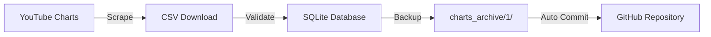
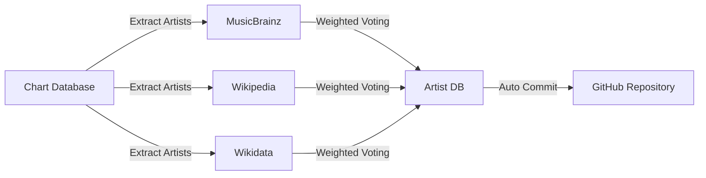

# 🎵 Music Charts Intelligence System

 
[](#) 
[](#) 
[](#)
[](#) 

A two-part automated system for downloading YouTube Charts data and enriching it with artist metadata (country and genre).

## 📋 Overview

This repository contains two Python scripts that work together to build a comprehensive music database:
| Script                   | Purpose                                                      | Key Technologies             | **🇬🇧 English Documentation**                                 | **🇪🇸 Spanish Documentation**                                 |
| ------------------------ | ------------------------------------------------------------ | :--------------------------- | ------------------------------------------------------------ | ------------------------------------------------------------ |
| **1_download.py**        | Downloads YouTube Charts weekly (100 songs) and stores in SQLite | Playwright, Pandas, SQLite   | [README](https://github.com/adroguetth/Music-Charts-Intelligence/blob/main/Documentation_EN/1_download.md) <br> [PDF](https://drive.google.com/file/d/1SdLvJnxcKxmQYmLlwoYttHr2Izud4iE5/view?usp=sharing) | [README](https://github.com/adroguetth/Music-Charts-Intelligence/blob/main/Documentation_ES/1_download.md) <br/> [PDF](https://drive.google.com/file/d/1SdLvJnxcKxmQYmLlwoYttHr2Izud4iE5/view?usp=sharing) |
| **2_build_artist_db.py** | Enriches artists with country and genre from MusicBrainz, Wikipedia, Wikidata | Requests, SQLite, custom NLP | [README](https://github.com/adroguetth/Music-Charts-Intelligence/blob/main/Documentation_EN/2_build_artist_db.md) | [README](https://github.com/adroguetth/Music-Charts-Intelligence/blob/main/Documentation_ES/2_build_artist_db.md) |


## 🚀 Quick Start

### Prerequisites

- Python 3.7+
- Git

### Installation

```bash
# Clone repository
git clone <your-repo-url>
cd <repo-name>

# Create virtual environment
python -m venv venv
source venv/bin/activate  # Linux/Mac
# venv\Scripts\activate    # Windows

# Install dependencies
pip install -r requirements.txt

# For Script 1 only (Playwright browser)
python -m playwright install chromium
```

## 🔄 How It Works

### Script 1: Download YouTube Charts



**What it does:**

- Runs every Monday at 12:00 UTC via GitHub Actions
- Downloads complete 100-song CSV with anti-detection measures
- Stores weekly data in versioned SQLite databases
- Creates automatic backups before updates
- Falls back to sample data if scraping fails

### Script 2: Enrich Artist Data



**What it does:**

- Runs after Script 1 completes (Monday 14:00 UTC)
- Queries multiple APIs for each artist
- Detects country (cities, demonyms, 30K+ terms)
- Classifies genre (200+ macro-genres, 5K+ mappings)
- Only updates missing data, never overwrites
- Uses smart caching to avoid redundant calls

## 📁 Output Structure

```text
charts_archive/
├── 1_download-chart/              # Script 1 output
│   ├── databases/
│   │   ├── youtube_charts_2025-W01.db
│   │   ├── youtube_charts_2025-W02.db
│   │   └── ...
│   └── backup/                     # Automatic backups
└── 2_artist_countries_genres/      # Script 2 output
    └── artist_countries_genres.db   # Enriched artist data
```

### Database Schema

**Script 1 DB (`chart_data` table):**

| Column       | Description         |
| :----------- | :------------------ |
| Rank         | Chart position      |
| Track Name   | Song title          |
| Artist Names | Artist(s)           |
| Views        | View count          |
| week_id      | ISO week identifier |

**Script 2 DB (`artist` table):**

| Column      | Description               | Example        |
| :---------- | :------------------------ | :------------- |
| name        | Artist name (primary key) | "BTS"          |
| country     | Canonical country         | "South Korea"  |
| macro_genre | Primary genre             | "K-Pop/K-Rock" |

------

## ⚙️ GitHub Actions Automation

Both scripts are fully automated via GitHub Actions:

### Script 1 Workflow

- **Schedule**: Every Monday, 12:00 UTC
- **Triggers**: Manual, or on script changes
- **Timeout**: 30 minutes

### Script 2 Workflow

- **Schedule**: Every Monday, 14:00 UTC
- **Triggers**: After Script 1 completes, or manual
- **Timeout**: 60 minutes (allows for API rate limits)

Both workflows automatically commit changes back to the repository.

------

## 🛠️ Configuration

### Script 1 Parameters (`1_download.py`)

```python
RETENTION_DAYS = 7      # Backup retention
RETENTION_WEEKS = 52    # Database retention
TIMEOUT = 120000        # Browser timeout (ms)
```

### Script 2 Parameters (`2_build_artist_db.py`)

```python
MIN_CANDIDATES = 3      # Min genre candidates before Wikipedia search
RETRY_DELAY = 0.5       # Delay between API calls (seconds)
DEFAULT_TIMEOUT = 10    # API timeout (seconds)
```

## 📊 Sample Output

After successful runs, you'll see:

- Weekly chart databases with 100 songs each
- Artist database growing by 10-50 new artists per week
- Automatic commits with descriptive messages

```text
✅ Script 1: YouTube Chart Update 2025-03-17 (Week 2025-W11)
✅ Script 2: Update artist database 2025-03-17 (147 new artists)
```

## 📄 License and Attribution

- **License**: MIT

- **Author**: Alfonso Droguett
  - 🔗 **LinkedIn:** [Alfonso Droguett](https://www.linkedin.com/in/adroguetth/)
  - 🌐 **Web portfolio:** [adroguett-portfolio.cl](https://www.adroguett-portfolio.cl/)
  - 📧 **Email:** [adroguett.consultor@gmail.com](mailto:adroguett.consultor@gmail.com)
---    

⭐ Found this useful? Star it on GitHub!
