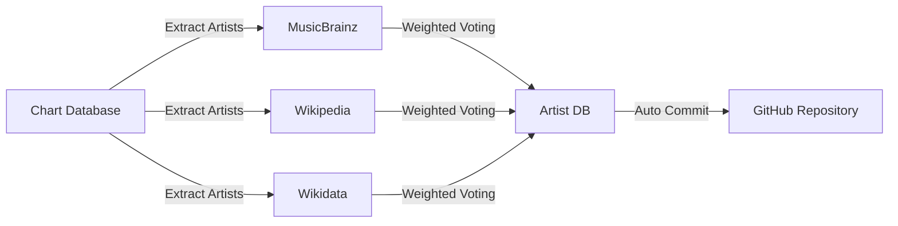

# 🎵 Music Charts Intelligence System
**🇪🇸 ¿Buscas la versión en español?** → [README.es.md](README.es.md)

         

A fully automated, end-to-end pipeline that downloads YouTube's weekly music charts, enriches every artist with geographic and genre metadata, and then augments each chart entry with deep YouTube video metadata — all running on GitHub Actions, zero manual intervention required.


## 📥 Documentation

| Script                     | Purpose                                                      | English Docs                                                 | Spanish Docs                                                 |
| -------------------------- | ------------------------------------------------------------ | ------------------------------------------------------------ | ------------------------------------------------------------ |
| **1_download.py**          | Downloads weekly YouTube Charts (100 songs) into SQLite      | README · [PDF](https://drive.google.com/file/d/11ANLX6PbK_eIzvHLPqL1rm9NY9rOshhD/view?usp=sharing) | README · [PDF](https://drive.google.com/file/d/1SdLvJnxcKxmQYmLlwoYttHr2Izud4iE5/view?usp=sharing) |
| **2_build_artist_db.py**   | Enriches artists with country + genre via MusicBrainz, Wikipedia, Wikidata | README · [PDF](https://drive.google.com/file/d/1viUAxZ7k-qeYYbyvZf2OaP20AfLOgKh2/view?usp=drive_link) | README · [PDF](https://drive.google.com/file/d/1WBHBreKeVToTBygSyCuYsHQUr_zSl3BT/view?usp=drive_link) |
| **3_enrich_chart_data.py** | Adds YouTube video metadata to every chart entry (3-layer system) | README                                                       | README                                                       |

> Each script's README contains detailed code analysis, configuration options, and troubleshooting guides. This document covers the system as a whole.

## 🗂️ System Architecture
 
The pipeline processes data in three distinct stages, each building on the previous one's output:
 
```
YouTube Charts (web)
        │
        ▼
┌───────────────────┐
│   Script 1        │  → Raw chart data (100 songs/week)
│   1_download.py   │    Rank, Track, Artist, Views, URL
└───────────────────┘
        │
        ▼
┌───────────────────┐
│   Script 2        │  → Artist reference database
│ 2_build_artist_db │    Artist → Country + Genre
└───────────────────┘
        │
        ▼
┌───────────────────┐
│   Script 3        │  → Fully enriched chart entries
│ 3_enrich_chart_   │    25 fields per song
│      data.py      │
└───────────────────┘
        │
        ▼
   SQLite Database
   (ready for analysis)
```
 
### Data Flow Between Scripts
 
| Stage | Input | Output | Records |
| :---- | :---- | :----- | :------ |
| Script 1 | YouTube Charts webpage | `youtube_charts_YYYY-WXX.db` | 100 songs/week |
| Script 2 | Script 1's database (artist names) | `artist_countries_genres.db` | Grows ~10–50 artists/week |
| Script 3 | Script 1's DB + Script 2's DB | `youtube_charts_YYYY-WXX_enriched.db` | 100 enriched rows/week |
 
# ⚙️ Automation Schedule
 
All three scripts are orchestrated by GitHub Actions and run automatically every Monday:
 
| Workflow | Schedule (UTC) | Trigger Logic | Timeout |
| :------- | :------------- | :------------ | :------ |
| `1_download-chart.yml` | Monday 12:00 | Cron + manual + push | 30 min |
| `2_update-artist-db.yml` | Monday 13:00 | Cron + after Script 1 | 60 min |
| `3_enrich-chart-data.yml` | Monday 14:00 | Cron + after Script 2 | 60 min |
 
The 1-hour gaps between each workflow ensure the previous step has finished before the next one begins. Each workflow commits its output directly back to the repository — no external storage needed.


### Required Secrets
 
| Secret | Used By | Purpose |
| :----- | :------ | :------ |
| `YOUTUBE_API_KEY` | Script 3 | YouTube Data API v3 for video metadata (Layer 1) |
 
Scripts 1 and 2 require no API keys. Script 3 works without a key but falls back to slower methods (Selenium, yt-dlp).
 
 
## 🔬 How Each Script Works
 
### Script 1 — Download YouTube Charts
 
Runs every Monday and scrapes the top 100 songs from YouTube Charts using Playwright with a headless Chromium browser. It implements multiple CSS selector strategies to find the download button, hides automation fingerprints with custom headers and JavaScript injection, and falls back to sample data if YouTube's interface changes.
 
Each weekly run produces a new, versioned SQLite database. Before writing, it creates a temporary backup of the existing file to prevent data loss. Old databases are cleaned up automatically based on a configurable retention period (default: 52 weeks).
 
**Key technical details:**
- Anti-detection: custom user agent, hidden `navigator.webdriver`, realistic viewport
- 3 fallback selectors for the download button (`#download-button`, `aria-label`, text)
- Backup naming: `backup_YYYY-WXX_YYYYMMDD_HHMMSS.db`
- Fallback data: 100 synthetic records with identical structure to real data
 
 
### Script 2 — Build Artist Database
 
Takes every unique artist name from Script 1's database and enriches it with country of origin and primary music genre. For each artist, it generates up to 15 name variations (removing accents, stripping prefixes, etc.) and queries them across three external knowledge bases in a cascading order.
 
**Country detection** uses a curated dictionary of 30,000+ geographic terms (cities, demonyms, regional references) to extract location signals from API responses. It checks MusicBrainz first (structured, reliable), then Wikipedia English (summary and infobox), then Wikipedia in priority languages (chosen based on detected script or known country), and finally Wikidata (properties P27 and P19).
 
**Genre detection** collects candidates from MusicBrainz tags and Wikidata's P136 property, then applies a weighted voting system across 200+ macro-genres and 5,000+ subgenre mappings. Country-specific priority bonuses are applied (e.g., K-Pop gets a 2.0× multiplier for South Korean artists).
 
The script never overwrites existing data — it only fills in missing fields. This makes re-runs safe and incremental.
 
**Key technical details:**
- 15 name variations per artist (e.g., "The Beatles" → "Beatles", "beatles", etc.)
- In-memory cache prevents duplicate API calls within a session
- Script detection (Cyrillic, Hangul, Devanagari, Arabic, etc.) guides Wikipedia language selection
- Weighted voting: MusicBrainz weight > Wikipedia weight > Wikidata weight
- Country-specific genre bonuses for 50+ countries
 
 
### Script 3 — Enrich Chart Data
 
Takes Script 1's latest chart database and Script 2's artist database and produces a fully enriched output with 25 fields per song. The most technically complex script in the system, it retrieves YouTube video metadata using a 3-layer strategy that always tries the fastest method first.
 
**Layer 1 — YouTube Data API v3** (0.3–0.8s/video): Retrieves exact duration, like count, comment count, audio language, regional restrictions, and upload date. Used when a valid API key is available and quota remains.
 
**Layer 2 — Selenium** (3–5s/video): Launches a headless Chrome browser and extracts metadata directly from the YouTube player. Used as fallback when the API is unavailable or quota is exhausted.
 
**Layer 3 — yt-dlp** (2–4s/video): Tries multiple client configurations (Android, iOS, Web) with retry delays to avoid bot detection. Used as a last resort.
 
Beyond video metadata, the script also classifies each entry using text analysis: it detects whether a video is official, a lyric video, a live performance, or a remix; classifies the channel type (VEVO, Topic, Label/Studio, Artist Channel); and resolves country/genre for collaborations using a weighted majority algorithm.
 
**Key technical details:**
- 196-country continent map for resolving multi-country collaborations
- Collaboration resolution: absolute majority (>50%) → relative majority → Multicountry
- 100+ country-specific genre hierarchies for tiebreaking
- Detects collaborations via regex patterns (feat., ft., &, x, with, con)
- Channel type detection via keyword matching
- Upload season (Q1–Q4) derived from upload date
 
 
## 📁 Repository Structure
```text
Music-Charts-Intelligence/
├── .github/workflows/
│   ├── 1_download-chart.yml
│   ├── 2_update-artist-db.yml
│   └── 3_enrich-chart-data.yml
│
├── scripts/
│   ├── 1_download.py
│   ├── 2_build_artist_db.py
│   └── 3_enrich_chart_data.py
│
│
├── charts_archive/
│   ├── 1_download-chart/
│   │   ├── latest_chart.csv              # Most recent chart (always updated)
│   │   ├── databases/
│   │   │   ├── youtube_charts_2025-W01.db
│   │   │   ├── youtube_charts_2025-W02.db
│   │   │   └── ...                       # One file per week
│   │   └── backup/
│   │       └── ...                       # Temporary pre-update backups
│   │
│   ├── 2_countries-genres-artist/
│   │   └── artist_countries_genres.db    # Cumulative artist enrichment DB
│   │
│   └── 3_enrich-chart-data/
│       ├── youtube_charts_2025-W01_enriched.db
│       ├── youtube_charts_2025-W02_enriched.db
│       └── ...                           # One enriched DB per week
│
├── Documentation_EN/
│   ├── 1_download.md
│   ├── 2_build_artist_db.md
│   └── 3_enrich_chart_data.md
│
├── Documentation_ES/
│   ├── 1_download.md
│   ├── 2_build_artist_db.md
│   └── 3_enrich_chart_data.md
│
├── requirements.txt
├── .gitignore
│
├── README.es.md
└── README.md
```
### Data Retention Policy
 
| Data | Retention | Configurable |
| :--- | :-------- | :----------- |
| Weekly chart databases (Script 1) | 52 weeks | `RETENTION_WEEKS` in script |
| Backup files (Script 1) | 7 days | `RETENTION_DAYS` in script |
| Enriched databases (Script 3) | 78 weeks | `RETENTION_WEEKS` in workflow |
| Artist database (Script 2) | Permanent (cumulative) | — |
 
## 🗄️ Database Schemas
 
### Script 1 Output — `chart_data` table
 
| Column | Type | Description |
| :----- | :--- | :---------- |
| `Rank` | INTEGER | Chart position (1–100) |
| `Previous Rank` | INTEGER | Position in previous week |
| `Track Name` | TEXT | Song title |
| `Artist Names` | TEXT | Artist(s), may include collaborations |
| `Periods on Chart` | INTEGER | Number of weeks on chart |
| `Views` | INTEGER | Total view count |
| `Growth` | TEXT | Week-over-week growth percentage |
| `YouTube URL` | TEXT | Direct video link |
| `download_date` | TEXT | Date of download |
| `download_timestamp` | TEXT | Full timestamp |
| `week_id` | TEXT | ISO week identifier (e.g., `2025-W11`) |

### Script 2 Output — `artist` table
 
| Column | Type | Description | Example |
| :----- | :--- | :---------- | :------ |
| `name` | TEXT (PK) | Canonical artist name | `"BTS"` |
| `country` | TEXT | Country of origin | `"South Korea"` |
| `macro_genre` | TEXT | Primary genre | `"K-Pop/K-Rock"` |


A two-part automated system for downloading YouTube Charts data and enriching it with artist metadata (country and genre).

## 📋 Overview 

This repository contains two Python scripts that work together to build a comprehensive music database: <br> <br>
Este repositorio contiene dos scripts de Python que trabajan juntos para construir una base de datos musical completa:
| Script                   | Purpose                                                      | Key Technologies             | **🇬🇧 English Documentation**                                 | **🇪🇸 Spanish Documentation**                                 |
| :----------------------- | :----------------------------------------------------------- | :--------------------------- | :----------------------------------------------------------- | :----------------------------------------------------------- |
| **1_download.py**        | Downloads YouTube Charts weekly (100 songs) and stores in SQLite | Playwright, Pandas, SQLite   | [README](https://github.com/adroguetth/Music-Charts-Intelligence/blob/main/Documentation_EN/1_download.md) <br> [PDF](https://drive.google.com/file/d/11ANLX6PbK_eIzvHLPqL1rm9NY9rOshhD/view?usp=sharing) | [README](https://github.com/adroguetth/Music-Charts-Intelligence/blob/main/Documentation_ES/1_download.md) <br/> [PDF](https://drive.google.com/file/d/1SdLvJnxcKxmQYmLlwoYttHr2Izud4iE5/view?usp=sharing) |
| **2_build_artist_db.py** | Enriches artists with country and genre from MusicBrainz, Wikipedia, Wikidata | Requests, SQLite, custom NLP | [README](https://github.com/adroguetth/Music-Charts-Intelligence/blob/main/Documentation_EN/2_build_artist_db.md) <br> [PDF](https://drive.google.com/file/d/1viUAxZ7k-qeYYbyvZf2OaP20AfLOgKh2/view?usp=drive_link) | [README](https://github.com/adroguetth/Music-Charts-Intelligence/blob/main/Documentation_ES/2_build_artist_db.md) <br> [PDF](https://drive.google.com/file/d/1WBHBreKeVToTBygSyCuYsHQUr_zSl3BT/view?usp=drive_link)  |


## 🚀 Quick Start

### Prerequisites

- Python 3.7+
- Git

### Installation

```bash
# Clone repository
git clone <your-repo-url>
cd <repo-name>

# Create virtual environment
python -m venv venv
source venv/bin/activate  # Linux/Mac
# venv\Scripts\activate    # Windows

# Install dependencies
pip install -r requirements.txt

# For Script 1 only (Playwright browser)
python -m playwright install chromium
```

## 🔄 How It Works

### Script 1: Download YouTube Charts


**What it does:**

- Runs every Monday at 12:00 UTC via GitHub Actions
- Downloads complete 100-song CSV with anti-detection measures
- Stores weekly data in versioned SQLite databases
- Creates automatic backups before updates
- Falls back to sample data if scraping fails

### Script 2: Enrich Artist Data



**What it does:**

- Runs after Script 1 completes (Monday 14:00 UTC)
- Queries multiple APIs for each artist
- Detects country (cities, demonyms, 30K+ terms)
- Classifies genre (200+ macro-genres, 5K+ mappings)
- Only updates missing data, never overwrites
- Uses smart caching to avoid redundant calls

## 📁 Output Structure

```text
charts_archive/
├── 1_download-chart/              # Script 1 output
│   ├── databases/
│   │   ├── youtube_charts_2025-W01.db
│   │   ├── youtube_charts_2025-W02.db
│   │   └── ...
│   └── backup/                     # Automatic backups
└── 2_artist-countries-genres/      # Script 2 output
    └── artist_countries_genres.db   # Enriched artist data
```

### Database Schema

**Script 1 DB (`chart_data` table):**

| Column       | Description         |
| :----------- | :------------------ |
| Rank         | Chart position      |
| Track Name   | Song title          |
| Artist Names | Artist(s)           |
| Views        | View count          |
| week_id      | ISO week identifier |

**Script 2 DB (`artist` table):**

| Column      | Description               | Example        |
| :---------- | :------------------------ | :------------- |
| name        | Artist name (primary key) | "BTS"          |
| country     | Canonical country         | "South Korea"  |
| macro_genre | Primary genre             | "K-Pop/K-Rock" |

------

## ⚙️ GitHub Actions Automation

Both scripts are fully automated via GitHub Actions:

### Script 1 Workflow

- **Schedule**: Every Monday, 12:00 UTC
- **Triggers**: Manual, or on script changes
- **Timeout**: 30 minutes

### Script 2 Workflow

- **Schedule**: Every Monday, 14:00 UTC
- **Triggers**: After Script 1 completes, or manual
- **Timeout**: 60 minutes (allows for API rate limits)

Both workflows automatically commit changes back to the repository.

------

## 🛠️ Configuration

### Script 1 Parameters (`1_download.py`)

```python
RETENTION_DAYS = 7      # Backup retention
RETENTION_WEEKS = 52    # Database retention
TIMEOUT = 120000        # Browser timeout (ms)
```

### Script 2 Parameters (`2_build_artist_db.py`)

```python
MIN_CANDIDATES = 3      # Min genre candidates before Wikipedia search
RETRY_DELAY = 0.5       # Delay between API calls (seconds)
DEFAULT_TIMEOUT = 10    # API timeout (seconds)
```

## 📊 Sample Output

After successful runs, you'll see:

- Weekly chart databases with 100 songs each
- Artist database growing by 10-50 new artists per week
- Automatic commits with descriptive messages

```text
✅ Script 1: YouTube Chart Update 2025-03-17 (Week 2025-W11)
✅ Script 2: Update artist database 2025-03-17 (147 new artists)
```

## 📄 License and Attribution

- **License**: MIT

- **Author**: Alfonso Droguett
  - 🔗 **LinkedIn:** [Alfonso Droguett](https://www.linkedin.com/in/adroguetth/)
  - 🌐 **Web portfolio:** [adroguett-portfolio.cl](https://www.adroguett-portfolio.cl/)
  - 📧 **Email:** [adroguett.consultor@gmail.com](mailto:adroguett.consultor@gmail.com)
---    

⭐ Found this useful? Star it on GitHub!
